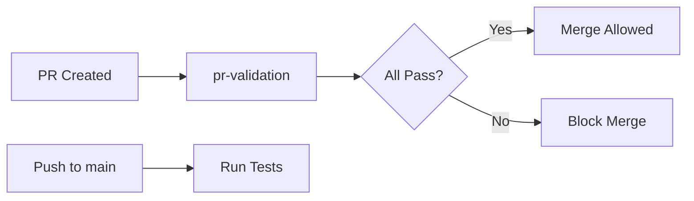
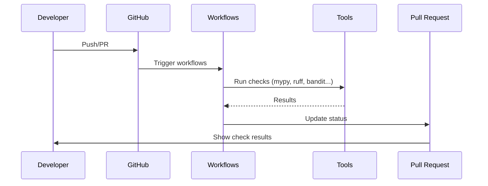
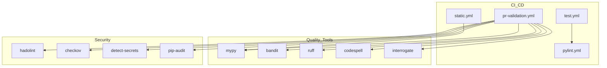

# GitHub Configuration

This directory contains GitHub-specific configuration for **wpostgresql**, including automated workflows (GitHub Actions) that enforce code quality, security, and testing standards.

## Overview

The CI/CD pipeline is designed to ensure every Pull Request meets the project's standards before merging. All workflows run automatically on configured events.

## Workflows

### pr-validation.yml

Comprehensive PR validation with 11 automated checks:

| Stage | Tool | Purpose |
|-------|------|---------|
| 1 | pre-commit | Syntax validation (YAML, JSON, AST, whitespace) |
| 2 | mypy | Static type checking |
| 3 | codespell | Spell checking |
| 4 | bandit | Security vulnerability detection |
| 5 | ruff | Linting and formatting |
| 6 | hadolint | Dockerfile linting |
| 7 | checkov | Dockerfile security scanning |
| 8 | detect-secrets | Secret exposure prevention |
| 9 | interrogate | Docstring coverage (>90%) |
| 10 | shellcheck | Shell script analysis |
| 11 | pip-audit | Dependency vulnerability scanning |

### test.yml

Automated test execution:
- Unit tests
- Integration tests
- Coverage reports

### pylint.yml

Code quality analysis:
- Pylint scoring (>9.5 required)
- Code style enforcement

### static.yml

Additional static analysis checks.

---

## 1. 🚶 Diagram Walkthrough

## 2. 🗺️ System Workflow

## 3. 🏗️ Architecture Components

## 4. ⚙️ Container Lifecycle

### Build Process
- Checkout code from repository
- Set up Python environment
- Install dependencies
- Run pre-commit hooks
- Execute each validation tool

### Runtime Process
1. GitHub event triggers workflow (PR/push)
2. Jobs run in parallel on GitHub runners
3. Each tool runs its checks
4. Results aggregated and reported
5. PR status updated (pass/fail)
6. Merge blocked if any check fails

## 5. 📂 File-by-File Guide

| File | Purpose |
|------|---------|
| `workflows/pr-validation.yml` | 11-stage PR validation pipeline |
| `workflows/test.yml` | Automated test execution |
| `workflows/pylint.yml` | Code quality scoring |
| `workflows/static.yml` | Static analysis checks |

---

## Quality Gates

| Metric | Threshold |
|--------|-----------|
| Pylint Score | > 9.5 |
| mypy | Pass (no errors) |
| Bandit | No high-severity issues |
| Docstring Coverage | > 90% |
| Test Coverage | > 80% |

## Usage

Workflows run automatically. Monitor results in:
- **GitHub Actions** tab → Workflow runs
- **Pull Request** checks section

## Security

- **Secret Detection**: Prevents accidental secret commits
- **Dependency Audit**: Flags known CVEs
- **Code Analysis**: Prevents common vulnerabilities

## Author

**William Rodríguez** - [wisrovi](mailto:wisrovi.rodriguez@gmail.com)

Technology Evangelist & Software Architect

LinkedIn: [William Rodríguez](https://www.linkedin.com/in/william-rodriguez-villamizar-572302207)
