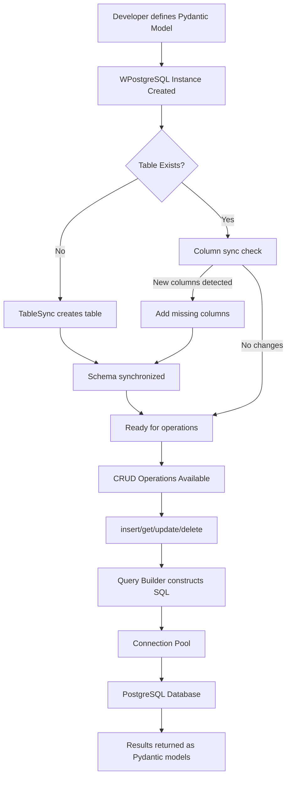

# wpostgresql

<p align="center">
    <a href="https://pypi.org/project/wpostgresql/">
        
    </a>
    <a href="https://pypi.org/project/wpostgresql/">
        
    </a>
    <a href="https://github.com/wisrovi/wpostgresql/blob/main/LICENSE">
        
    </a>
    <a href="https://github.com/wisrovi/wpostgresql/actions">
        
    </a>
    <a href="https://pylint.org/">
        
    </a>
    <a href="https://bandit.readthedocs.io/">
        
    </a>
    <a href="https://pepy.tech/projects/wpostgresql">
        
    </a>
</p>

**wpostgresql** is a high-performance, type-safe PostgreSQL ORM that leverages Pydantic models for schema definition and automatic table synchronization. It provides a seamless developer experience with full support for both synchronous and asynchronous operations.

## Key Features

- **Pydantic Integration** — Define database schemas using Pydantic v2 models with automatic type validation
- **Auto Table Synchronization** — Tables are created and updated automatically based on model changes
- **Type-Safe Operations** — Full type hints with Pydantic validation for data integrity
- **Async/Await Support** — Complete async API for high-performance applications
- **Connection Pooling** — Built-in connection pooling for both sync and async operations
- **Transaction Management** — Robust transaction support with automatic rollback
- **Bulk Operations** — Efficient bulk insert, update, and delete operations
- **Constraint Support** — Primary Key, UNIQUE, and NOT NULL constraints via field descriptions
- **Query Builder** — Safe SQL query construction with injection prevention
- **CLI Tool** — Command-line interface for database management
- **Code Quality** — Pylint score > 9.5, Bandit security checks passing, mypy type checking
- **Pagination** — LIMIT/OFFSET and page-number based pagination

## Technical Stack

| Component | Technology |
|-----------|------------|
| Language | Python 3.9+ |
| Database | PostgreSQL 13+ |
| ORM Core | psycopg 3.x, psycopg_pool |
| Validation | Pydantic 2.x |
| Logging | Loguru |
| CLI | Click |
| Testing | pytest, pytest-cov |
| Linting | ruff, pylint |
| Type Checking | mypy |
| Security | bandit, detect-secrets |
| Containerization | Docker, Docker Compose |
| Documentation | Sphinx, Read the Docs |

## Installation & Setup

### Prerequisites

- Python 3.9 or higher
- PostgreSQL 13 or higher
- Docker (optional, for containerized setup)

### Using pip

```bash
pip install wpostgresql
```

### From Source

```bash
# Clone the repository
git clone https://github.com/wisrovi/wpostgresql.git
cd wpostgresql

# Create and activate virtual environment
python -m venv venv
source venv/bin/activate  # On Windows: venv\Scripts\activate

# Install with development dependencies
pip install -e ".[dev]"
```

### Using Docker (Optional)

```bash
cd docker
docker-compose up -d
```

This starts:
- PostgreSQL 13.2 on port 5432
- pgAdmin4 on port 1717

## Architecture & Workflow

### File Tree

```
wpostgresql/
├── .github/
│   └── workflows/           # CI/CD pipelines
│       ├── pr-validation.yml
│       ├── test.yml
│       ├── pylint.yml
│       └── static.yml
├── src/wpostgresql/         # Core library
│   ├── __init__.py
│   ├── builders/            # SQL query builder
│   │   └── query_builder.py
│   ├── cli/                 # CLI tool
│   │   └── main.py
│   ├── core/                # ORM core
│   │   ├── connection.py    # Connection pooling
│   │   ├── repository.py   # WPostgreSQL class
│   │   └── sync.py         # Table sync
│   ├── exceptions/          # Custom exceptions
│   │   └── __init__.py
│   └── types/               # SQL type mapping
│       └── sql_types.py
├── docs/                    # Sphinx documentation
│   ├── getting_started/
│   ├── api_reference/
│   └── tutorials/
├── examples/                # Usage examples
│   ├── 01_crud/
│   ├── 02_new_columns/
│   ├── 03_restrictions/
│   ├── 04_pagination/
│   ├── 05_transactions/
│   ├── 06_bulk_operations/
│   ├── 07_connection_pooling/
│   ├── 08_logging/
│   ├── 09_async/
│   ├── 10_aggregations/
│   ├── 11_timestamps/
│   ├── 12_raw_sql/
│   ├── 13_soft_delete/
│   └── 14_relationships/
├── test/                    # Unit and integration tests
│   └── ...
├── docker/                  # Docker configuration
│   ├── docker-compose.yaml
│   └── Dockerfile.postgress
├── pyproject.toml          # Project configuration
└── README.md
```

### System Workflow



## Configuration

### Database Connection Configuration

Create a configuration dictionary:

```python
DB_CONFIG = {
    "dbname": "your_database",
    "user": "your_user",
    "password": "your_password",
    "host": "localhost",
    "port": 5432,
}
```

### Environment Variables (Recommended)

For production, use environment variables to avoid exposing credentials:

```python
import os

DB_CONFIG = {
    "dbname": os.getenv("DB_NAME", "mydb"),
    "user": os.getenv("DB_USER", "postgres"),
    "password": os.getenv("DB_PASSWORD"),
    "host": os.getenv("DB_HOST", "localhost"),
    "port": int(os.getenv("DB_PORT", 5432)),
}
```

### Connection Pool Configuration

```python
POOL_CONFIG = {
    "min_size": 2,
    "max_size": 20,
    "timeout": 30,
}
```

## Usage

### Basic Sync Usage

```python
from pydantic import BaseModel
from wpostgresql import WPostgreSQL

class User(BaseModel):
    id: int
    name: str
    email: str

DB_CONFIG = {
    "dbname": "mydb",
    "user": "postgres",
    "password": "secret",
    "host": "localhost",
    "port": 5432,
}

db = WPostgreSQL(User, DB_CONFIG)

# Insert
db.insert(User(id=1, name="John", email="john@example.com"))

# Query all
users = db.get_all()

# Query by field
john = db.get_by_field(name="John")

# Update
db.update(1, User(id=1, name="Jane", email="jane@example.com"))

# Delete
db.delete(1)
```

### Async Usage

```python
import asyncio
from pydantic import BaseModel
from wpostgresql import WPostgreSQL

class User(BaseModel):
    id: int
    name: str
    email: str

async def main():
    db = WPostgreSQL(User, DB_CONFIG)
    
    await db.insert_async(User(id=1, name="John", email="john@example.com"))
    users = await db.get_all_async()
    print(users)

asyncio.run(main())
```

### CLI Commands

```bash
# View help
wpostgresql --help

# Sync table from model
wpostgresql sync path/to/model.py

# Check connection status
wpostgresql status
```

## Testing

```bash
# Run all tests
pytest

# Run with coverage
pytest --cov=wpostgresql --cov-report=html

# Run specific test file
pytest test/unit/test_connection.py -v
```

## Project Quality Metrics

| Metric | Status |
|--------|--------|
| Pylint Score | > 9.5 |
| Bandit Security | Passing |
| mypy Type Check | Passing |
| Code Coverage | > 80% |
| Docstring Coverage | > 90% |

## Contributing

Contributions are welcome. Please read our [Contributing Guide](CONTRIBUTING.md) for guidelines.

## License

MIT License — see [LICENSE](LICENSE) file for details.

## Author

**William Rodríguez** - [wisrovi](mailto:wisrovi.rodriguez@gmail.com)

Technology Evangelist & Software Architect

LinkedIn: [William Rodríguez](https://www.linkedin.com/in/william-rodriguez-villamizar-572302207)

---

<p align="center">
    Built with ❤️ for the Python community
</p>
