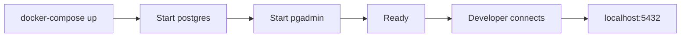
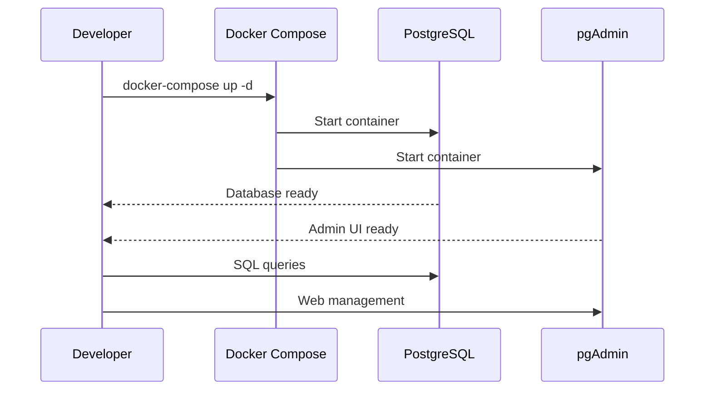
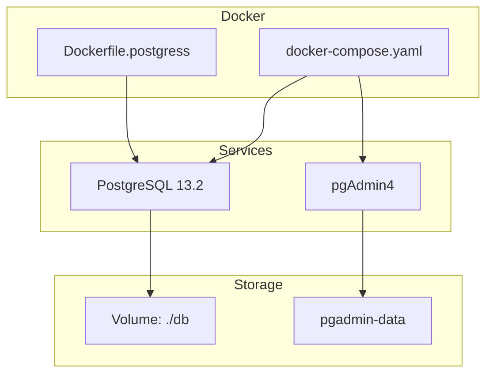

# Docker Configuration

This directory contains Docker and Docker Compose configurations for deploying a PostgreSQL environment with advanced extensions and a web-based administration interface.

## Overview

The Docker setup provides a ready-to-use PostgreSQL 13.2 development environment with:
- PostgreSQL database server with useful extensions
- pgAdmin4 web interface for visual database management
- Persistent storage volumes for data preservation
- Resource limits for controlled container execution

## Components

### docker-compose.yaml

Defines two main services:

| Service | Image | Port | Description |
|---------|-------|------|-------------|
| postgres | postgres:13.2 | 5432 | PostgreSQL database server |
| pgadmin | dpage/pgadmin4 | 1717 | Web-based database administration |

**Default Configuration:**
- Database: `wpostgresql`
- User: `postgres`
- Password: `postgres`
- Volume: `./db` for persistent storage

### Dockerfile.postgress

Custom PostgreSQL image with additional extensions:
- `plpython3u` — Python procedural language
- `pg_stat_statements` — Performance statistics
- `postgis` — Geospatial capabilities
- Python packages: `requests`, `pandas`

---

## 1. 🚶 Diagram Walkthrough



## 2. 🗺️ System Workflow



## 3. 🏗️ Architecture Components



## 4. ⚙️ Container Lifecycle

### Build Process
- Base image: `postgres:13.2`
- Install system packages: python3, postgresql-plpython3-13
- Install Python packages: requests
- Create SQL init scripts for extensions
- Configure environment variables

### Runtime Process
1. Container starts with entrypoint script
2. PostgreSQL initializes data directory
3. SQL init scripts execute (plpython3u, pg_stat_statements, postgis)
4. Database created with configured credentials
5. pgAdmin4 starts and configures admin user
6. Services listen on ports 5432 and 1717

## 5. 📂 File-by-File Guide

| File | Purpose |
|------|---------|
| `docker-compose.yaml` | Defines PostgreSQL and pgAdmin services with configuration |
| `Dockerfile.postgress` | Custom PostgreSQL image with Python and extensions |

---

## Installation & Setup

### Prerequisites

- Docker Engine 20.10+
- Docker Compose 2.0+

### Quick Start

```bash
# Navigate to docker directory
cd docker

# Start containers
docker-compose up -d

# Verify containers are running
docker-compose ps
```

### Access Details

| Service | URL | Credentials |
|---------|-----|-------------|
| PostgreSQL | `localhost:5432` | user: `postgres`, password: `postgres` |
| pgAdmin | `http://localhost:1717` | email: `wisrovi.rodriguez@gmail.com`, password: `12345678` |

### Stopping Services

```bash
# Stop containers
docker-compose down

# Stop and remove volumes (WARNING: loses data)
docker-compose down -v
```

## Configuration

### Environment Variables

Modify `docker-compose.yaml` to customize:

```yaml
environment:
  - POSTGRES_USER=your_user
  - POSTGRES_PASSWORD=your_password
  - POSTGRES_DB=your_database
```

### Resource Limits

Default limits are configured:

```yaml
deploy:
  resources:
    limits:
      cpus: "0.50"
      memory: 1024M
    reservations:
      cpus: "0.25"
      memory: 512M
```

## Security Notes

⚠️ **Important:**
- Default credentials are for development only
- Change passwords before production deployment
- Restrict network access in production environments

## Troubleshooting

```bash
# View logs
docker-compose logs -f postgres
docker-compose logs -f pgadmin

# Access container shell
docker-compose exec postgres bash
docker-compose exec pgadmin bash

# Check volume mounts
docker volume ls | grep wpostgresql
```

## Author

**William Rodríguez** - [wisrovi](mailto:wisrovi.rodriguez@gmail.com)

Technology Evangelist & Software Architect

LinkedIn: [William Rodríguez](https://www.linkedin.com/in/william-rodriguez-villamizar-572302207)
