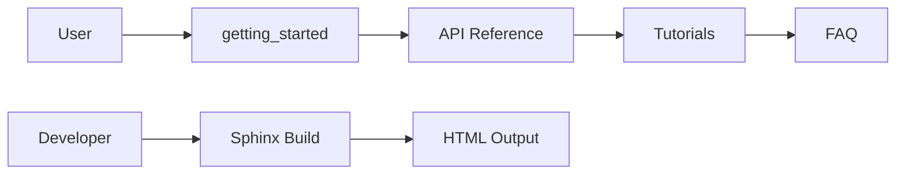
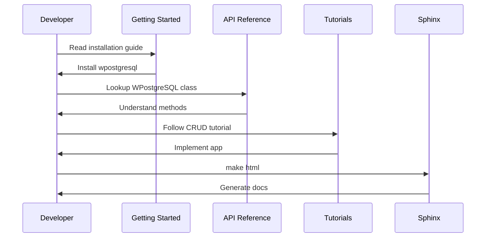
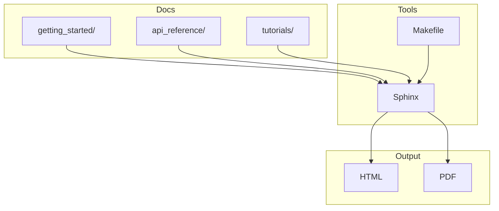

# Documentation

This directory contains the complete project documentation for **wpostgresql**, built using Sphinx. It provides comprehensive guides for getting started, API references, tutorials, FAQ, and a glossary.

## Structure

```
docs/
├── _static/                  # Static assets
├── getting_started/         # Installation and quickstart guides
│   ├── installation.rst
│   ├── quickstart.rst
│   ├── configuration.rst
│   └── basic_usage.rst
├── api_reference/           # API documentation
│   ├── repository.rst
│   ├── connection.rst
│   ├── sync.rst
│   ├── exceptions.rst
│   └── query_builder.rst
├── tutorials/                # Practical tutorials
│   ├── crud_operations.rst
│   ├── pagination.rst
│   ├── transactions.rst
│   ├── bulk_operations.rst
│   ├── async_operations.rst
│   ├── relationships.rst
│   ├── advanced_features.rst
│   └── stress_test.rst
├── conf.py                  # Sphinx configuration
├── index.rst                # Documentation master file
├── faq.rst                  # Frequently asked questions
├── glossary.rst              # Technical terms glossary
├── bibliography.rst         # References and links
├── requirements.txt         # Documentation dependencies
└── Makefile                 # Build commands
```

---

## 1. 🚶 Diagram Walkthrough



## 2. 🗺️ System Workflow



## 3. 🏗️ Architecture Components



## 4. ⚙️ Container Lifecycle

### Build Process
- Install dependencies from `requirements.txt`
- Parse RST files from all sections
- Generate cross-references and indexes
- Build HTML/PDF output

### Runtime Process
1. Sphinx reads `conf.py` for configuration
2. Processes all `.rst` files in order
3. Generates table of contents
4. Creates HTML or PDF output
5. Output available in `build/` directory

## 5. 📂 File-by-File Guide

| File/Folder | Purpose |
|-------------|---------|
| `conf.py` | Sphinx configuration, project metadata |
| `index.rst` | Master file, table of contents |
| `getting_started/` | Installation, quickstart, configuration guides |
| `api_reference/` | WPostgreSQL, Connection, Sync, Exceptions API docs |
| `tutorials/` | CRUD, pagination, transactions, async tutorials |
| `faq.rst` | Frequently asked questions |
| `glossary.rst` | Technical terms glossary |
| `Makefile` | Build commands (html, pdf, clean) |

---

## Building Documentation

### Prerequisites

```bash
pip install -r requirements.txt
```

### Build Commands

```bash
# Build HTML documentation
make html

# Build PDF documentation
make latexpdf

# Clean build files
make clean

# Build single file
make singlehtml
```

### Output Locations

- HTML: `build/html/index.html`
- PDF: `build/latex/wpostgresql.pdf`
- Single HTML: `build/singlehtml/index.html`

## Content Overview

### Getting Started

| Document | Description |
|----------|-------------|
| installation | Installation instructions for pip, Docker, and source |
| quickstart | 5-minute quickstart guide |
| configuration | Database and connection configuration |
| basic_usage | Basic CRUD operations tutorial |

### API Reference

| Document | Description |
|----------|-------------|
| repository | WPostgreSQL class and CRUD methods |
| connection | Connection management and pooling |
| sync | Table synchronization API |
| exceptions | Custom exception reference |
| query_builder | Query builder usage |

### Tutorials

- **CRUD Operations** — Create, Read, Update, Delete
- **Pagination** — LIMIT/OFFSET and page-based
- **Transactions** — Sync and async transaction handling
- **Bulk Operations** — Mass insert/update/delete
- **Async Operations** — Async/await patterns
- **Relationships** — One-to-many, many-to-many, one-to-one
- **Advanced Features** — Complex use cases

## Author

**William Rodríguez** - [wisrovi](mailto:wisrovi.rodriguez@gmail.com)

Technology Evangelist & Software Architect

LinkedIn: [William Rodríguez](https://www.linkedin.com/in/william-rodriguez-villamizar-572302207)
