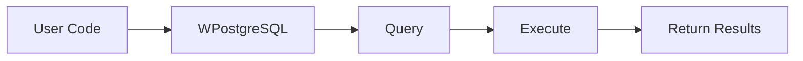
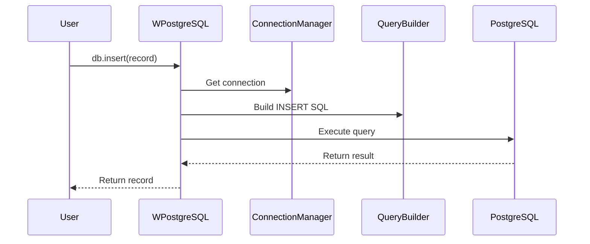
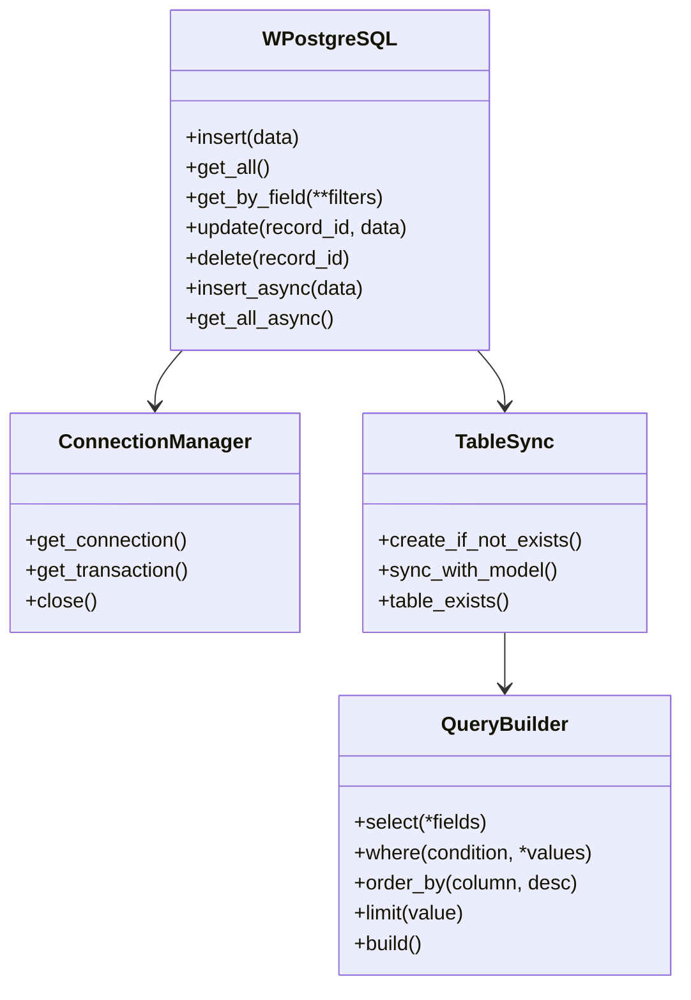

# API Reference

This section provides complete reference documentation for the **wpostgresql** API, describing classes, methods, and available modules.

## Documents

| Document | Description |
|----------|-------------|
| [repository.rst](api_reference/repository.rst) | WPostgreSQL class and CRUD operations |
| [connection.rst](api_reference/connection.rst) | ConnectionManager, AsyncConnectionManager, transactions |
| [sync.rst](api_reference/sync.rst) | TableSync and AsyncTableSync schema synchronization |
| [exceptions.rst](api_reference/exceptions.rst) | Custom exception reference |
| [query_builder.rst](api_reference/query_builder.rst) | QueryBuilder for dynamic SQL construction |

---

## 1. 🚶 Diagram Walkthrough



## 2. 🗺️ System Workflow



## 3. 🏗️ Architecture Components



## 4. ⚙️ Container Lifecycle

### Build Process
- Sphinx processes RST files
- Generates API documentation
- Creates cross-references between modules

### Runtime Process
1. User looks up method in docs
2. Reads description and parameters
3. Copies example code
4. Implements in application

## 5. 📂 File-by-File Guide

| File | Purpose |
|------|---------|
| `repository.rst` | WPostgreSQL class, CRUD methods |
| `connection.rst` | Connection pooling, transactions |
| `sync.rst` | Table sync API |
| `exceptions.rst` | Custom exceptions |
| `query_builder.rst` | Query building API |

---

### WPostgreSQL Methods (Sync)

| Method | Description | Returns |
|--------|-------------|---------|
| `insert(data)` | Insert a record | `data` |
| `get_all()` | Get all records | `List[Model]` |
| `get_by_field(**filters)` | Get by field filter | `List[Model]` |
| `get_paginated(limit, offset)` | Paginated results | `List[Model]` |
| `update(record_id, data)` | Update a record | `bool` |
| `delete(record_id)` | Delete a record | `bool` |
| `count()` | Count total records | `int` |
| `insert_many(data_list)` | Bulk insert | `int` |

### Connection Management

| Class | Description |
|-------|-------------|
| `ConnectionManager` | Synchronous connection pooling |
| `AsyncConnectionManager` | Asynchronous connection pooling |
| `Transaction` | Synchronous transaction context |
| `AsyncTransaction` | Asynchronous transaction context |

### Exception Hierarchy

```
WPostgreSQLError (base)
├── ConnectionError
├── TableSyncError
├── ValidationError
├── OperationError
├── SQLInjectionError
└── TransactionError
```

## Usage Examples

### Basic Operations

```python
from wpostgresql import WPostgreSQL

db = WPostgreSQL(Model, db_config)

# Insert
db.insert(record)

# Query
results = db.get_all()

# Update
db.update(id, updated_record)

# Delete
db.delete(id)
```

### Connection Management

```python
from wpostgresql import ConnectionManager

with ConnectionManager(db_config) as conn:
    # Use connection
    cursor = conn.cursor()
```

### Custom Queries

```python
from wpostgresql.builders import QueryBuilder

query = QueryBuilder("users")
query.select("id", "name").where("active = %s", True)
sql, params = query.build()
```

## Author

**William Rodríguez** - [wisrovi](mailto:wisrovi.rodriguez@gmail.com)

Technology Evangelist & Software Architect

LinkedIn: [William Rodríguez](https://www.linkedin.com/in/william-rodriguez-villamizar-572302207)
