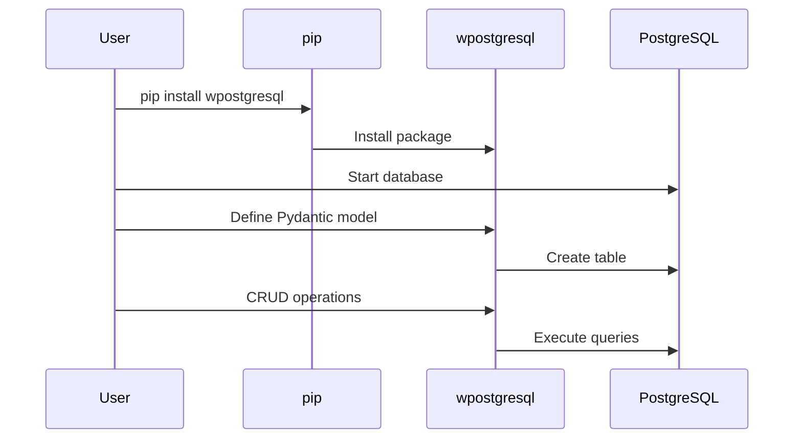
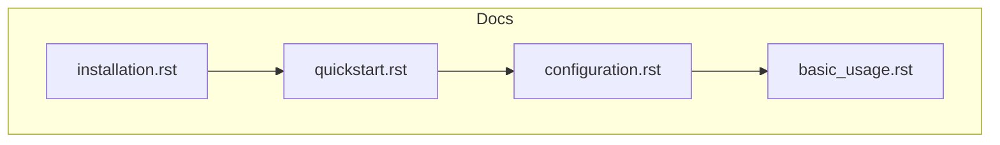

# Getting Started

This section provides comprehensive guides to help new users get started with **wpostgresql**, from installation to basic usage.

## Documents

| Document | Description |
|----------|-------------|
| [installation.rst](getting_started/installation.rst) | Installation instructions for pip, Docker, and source |
| [quickstart.rst](getting_started/quickstart.rst) | 5-minute quickstart guide |
| [configuration.rst](getting_started/configuration.rst) | Database and connection configuration options |
| [basic_usage.rst](getting_started/basic_usage.rst) | Basic CRUD operations tutorial with code examples |

---

## 1. 🚶 Diagram Walkthrough


## 2. 🗺️ System Workflow



## 3. 🏗️ Architecture Components



## 4. ⚙️ Container Lifecycle

### Build Process
- Document sources in RST format
- Sphinx processes all files
- Cross-references generated

### Runtime Process
1. User reads installation guide
2. Installs wpostgresql via pip
3. Configures database connection
4. Runs basic CRUD examples
5. Ready for production use

## 5. 📂 File-by-File Guide

| File | Purpose |
|------|---------|
| `installation.rst` | pip, Docker, source installation |
| `quickstart.rst` | 5-minute guide |
| `configuration.rst` | Database config options |
| `basic_usage.rst` | CRUD tutorial |

---

## Quick Reference

### Installation

```bash
pip install wpostgresql
```

### Basic Usage

```python
from pydantic import BaseModel
from wpostgresql import WPostgreSQL

class User(BaseModel):
    id: int
    name: str
    email: str

db = WPostgreSQL(User, db_config)
db.insert(User(id=1, name="John", email="john@example.com"))
```

## Prerequisites

- Python 3.9+
- PostgreSQL 13+
- psycopg 3.x

## Next Steps

After completing the Getting Started guides, explore:
- [API Reference](../api_reference/index.rst) — Detailed API documentation
- [Tutorials](../tutorials/index.rst) — Practical examples for common use cases

## Author

**William Rodríguez** - [wisrovi](mailto:wisrovi.rodriguez@gmail.com)

Technology Evangelist & Software Architect

LinkedIn: [William Rodríguez](https://www.linkedin.com/in/william-rodriguez-villamizar-572302207)
