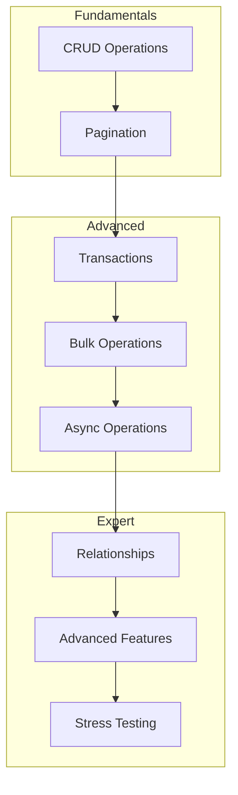
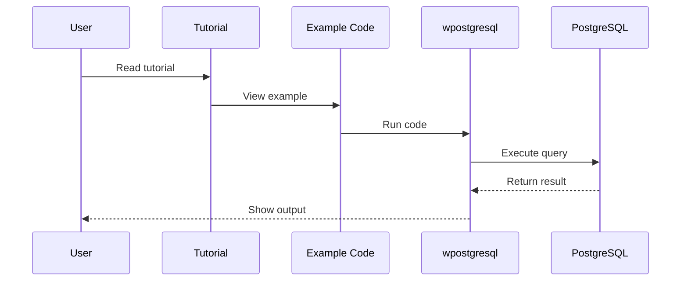
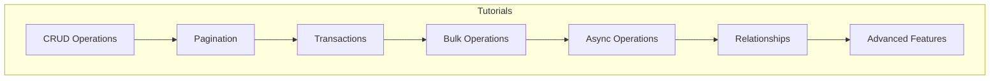

# Tutorials

This section provides practical tutorials for learning **wpostgresql** across different scenarios and use cases.

## Documents

| Document | Description |
|----------|-------------|
| [crud_operations.rst](tutorials/crud_operations.rst) | Create, Read, Update, Delete operations |
| [pagination.rst](tutorials/pagination.rst) | Result pagination implementation |
| [transactions.rst](tutorials/transactions.rst) | Synchronous and asynchronous transactions |
| [bulk_operations.rst](tutorials/bulk_operations.rst) | Bulk insert, update, delete |
| [async_operations.rst](tutorials/async_operations.rst) | Async/await API usage |
| [relationships.rst](tutorials/relationships.rst) | Table relationships |
| [advanced_features.rst](tutorials/advanced_features.rst) | Advanced features |
| [stress_test.rst](tutorials/stress_test.rst) | Stress testing guide |

---

## 1. 🚶 Diagram Walkthrough



## 2. 🗺️ System Workflow



## 3. 🏗️ Architecture Components



## 4. ⚙️ Container Lifecycle

### Build Process
- RST files processed by Sphinx
- Code examples validated
- Cross-references generated

### Runtime Process
1. User selects tutorial
2. Reads explanation and code
3. Runs example locally
4. Applies to own project

## 5. 📂 File-by-File Guide

| File | Purpose |
|------|---------|
| `crud_operations.rst` | Basic CRUD tutorial |
| `pagination.rst` | LIMIT/OFFSET, page-based |
| `transactions.rst` | ACID operations |
| `bulk_operations.rst` | Mass insert/update/delete |
| `async_operations.rst` | Async/await patterns |
| `relationships.rst` | Table relationships |
| `advanced_features.rst` | Complex use cases |
| `stress_test.rst` | Performance testing |

---

## Quick Access

### Beginner
- **CRUD Operations** — Start here for basic database operations
- **Pagination** — Learn to handle large datasets

### Intermediate
- **Transactions** — Master ACID operations
- **Bulk Operations** — Optimize for large data volumes

### Advanced
- **Async Operations** — Build high-performance apps
- **Relationships** — Model complex data structures
- **Advanced Features** — Deep dive into capabilities
- **Stress Testing** — Performance validation

## Example: Basic CRUD

```python
from wpostgresql import WPostgreSQL
from pydantic import BaseModel

class User(BaseModel):
    id: int
    name: str
    email: str

db = WPostgreSQL(User, db_config)

# CREATE
db.insert(User(id=1, name="John", email="john@example.com"))

# READ
users = db.get_all()
john = db.get_by_field(name="John")

# UPDATE
db.update(1, User(id=1, name="Jane", email="jane@example.com"))

# DELETE
db.delete(1)
```

## Author

**William Rodríguez** - [wisrovi](mailto:wisrovi.rodriguez@gmail.com)

Technology Evangelist & Software Architect

LinkedIn: [William Rodríguez](https://www.linkedin.com/in/william-rodriguez-villamizar-572302207)
