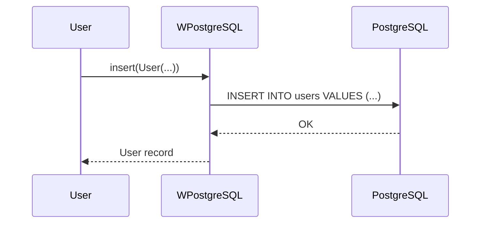
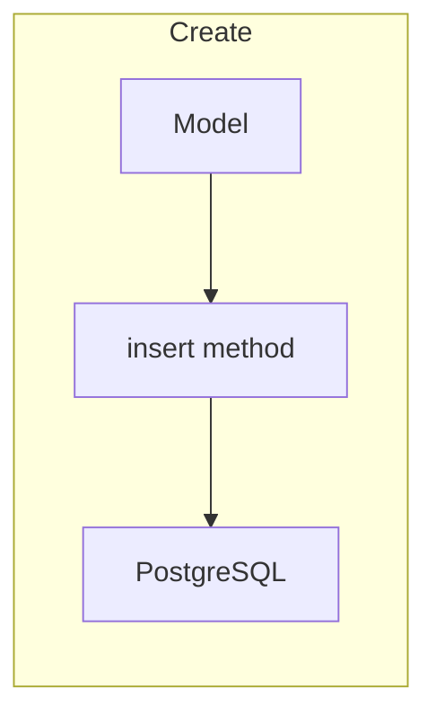

# Create - Insert Records

This example demonstrates how to insert new records into the database.

---

## 1. 🚶 Diagram Walkthrough

```mermaid
flowchart LR
    A[Model] --> B[insert()]
    B --> C[SQL INSERT]
    C --> D[PostgreSQL]
```

## 2. 🗺️ System Workflow



## 3. 🏗️ Architecture Components



## 4. ⚙️ Container Lifecycle

### Build Process
- Example code written

### Runtime Process
1. User creates Pydantic model instance
2. Calls db.insert()
3. SQL generated and executed
4. Record returned

## 5. 📂 File-by-File Guide

| File | Purpose |
|------|---------|
| `example.py` | Insert example code |
| `README.md` | This documentation |

---

## Usage

```bash
python example.py
```

## Explanation

1. Define a Pydantic `User` model with fields: `id`, `name`, `age`, `is_active`
2. Create `WPostgreSQL` instance which automatically creates the table if not exists
3. Use `insert()` method to add records
4. Records are automatically validated with Pydantic

## Expected Output

```
Users created: [User(id=1, name='John Doe', age=30, is_active=True), User(id=2, name='Jane Doe', age=25, is_active=True)]
```

## Author

**William Rodríguez** - [wisrovi](mailto:wisrovi.rodriguez@gmail.com)

Technology Evangelist & Software Architect

LinkedIn: [William Rodríguez](https://www.linkedin.com/in/william-rodriguez-villamizar-572302207)
