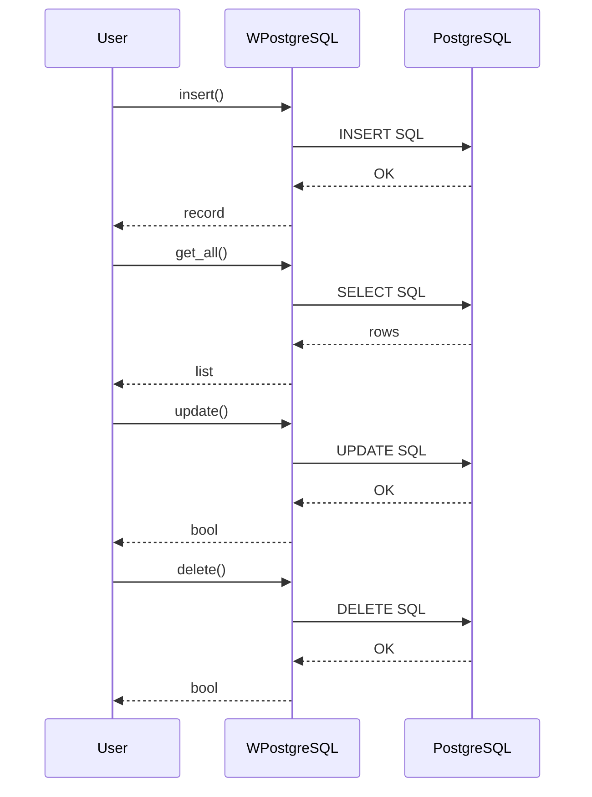
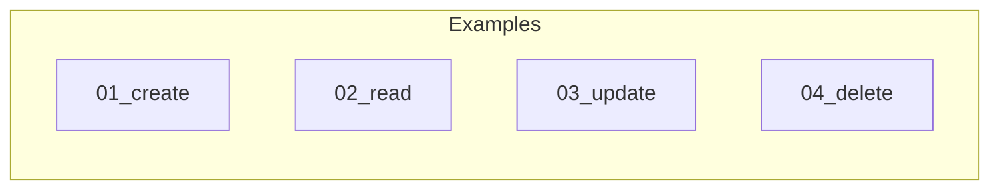

# 01 - CRUD Operations

This folder contains examples of basic **CRUD** (Create, Read, Update, Delete) operations using **wpostgresql**.

---

## 1. 🚶 Diagram Walkthrough


## 2. 🗺️ System Workflow



## 3. 🏗️ Architecture Components



## 4. ⚙️ Container Lifecycle

### Build Process
- Example code written
- README documentation created

### Runtime Process
1. User reads example
2. Runs code
3. Observes output
4. Applies to project

## 5. 📂 File-by-File Guide

| Folder | Purpose |
|--------|---------|
| `01_create/` | Insert records |
| `02_read/` | Query records |
| `03_update/` | Update records |
| `04_delete/` | Delete records |

---

## Contents

| Folder | Description |
|--------|-------------|
| [01_create](01_create/) | Inserting records into the database |
| [02_read](02_read/) | Querying and retrieving data |
| [03_update](03_update/) | Updating existing records |
| [04_delete](04_delete/) | Deleting records |

## Quick Reference

```python
from wpostgresql import WPostgreSQL
from pydantic import BaseModel

class User(BaseModel):
    id: int
    name: str
    email: str

db = WPostgreSQL(User, db_config)

# CREATE
db.insert(User(id=1, name="John", email="john@example.com"))

# READ
all_users = db.get_all()
john = db.get_by_field(name="John")

# UPDATE
db.update(1, User(id=1, name="Jane", email="jane@example.com"))

# DELETE
db.delete(1)
```

## Author

**William Rodríguez** - [wisrovi](mailto:wisrovi.rodriguez@gmail.com)

Technology Evangelist & Software Architect

LinkedIn: [William Rodríguez](https://www.linkedin.com/in/william-rodriguez-villamizar-572302207)
