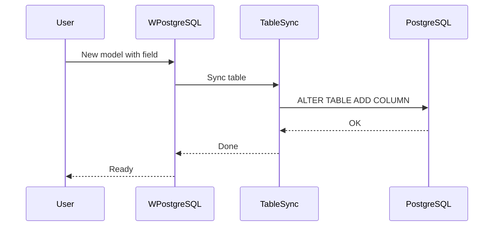
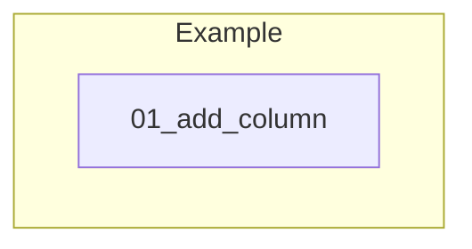

# 02 - New Columns

This folder contains examples of how to add and manage new columns in existing tables using **wpostgresql**.

---

## 1. 🚶 Diagram Walkthrough


## 2. 🗺️ System Workflow



## 3. 🏗️ Architecture Components



## 4. ⚙️ Container Lifecycle

### Build Process
- Example code written

### Runtime Process
1. User updates model
2. Creates WPostgreSQL instance
3. TableSync detects changes
4. ALTER TABLE executed

## 5. 📂 File-by-File Guide

| Folder | Purpose |
|--------|---------|
| `01_add_column/` | Add columns to existing tables |

---

## Contents

| Folder | Description |
|--------|-------------|
| [01_add_column](01_add_column/) | Adding columns to existing tables with data types and constraints |

## Overview

wpostgresql's `TableSync` automatically detects model changes and adds missing columns:

```python
from wpostgresql import WPostgreSQL, TableSync

# Original model
class User(BaseModel):
    id: int
    name: str

# Updated model - add new field
class User(BaseModel):
    id: int
    name: str
    email: str  # New column

# Sync automatically adds the column
sync = TableSync(User, db_config)
sync.sync_with_model()
```

## Author

**William Rodríguez** - [wisrovi](mailto:wisrovi.rodriguez@gmail.com)

Technology Evangelist & Software Architect

LinkedIn: [William Rodríguez](https://www.linkedin.com/in/william-rodriguez-villamizar-572302207)
