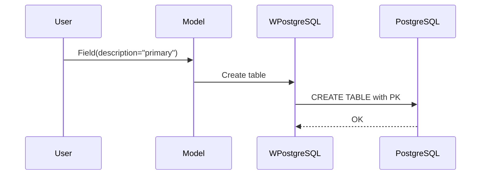
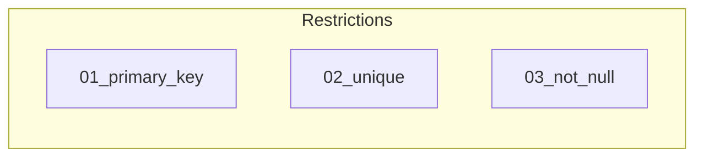

# 03 - Database Restrictions

This folder contains examples of how to define and use **database constraints** in Pydantic models with **wpostgresql**.

---

## 1. 🚶 Diagram Walkthrough


## 2. 🗺️ System Workflow



## 3. 🏗️ Architecture Components



## 4. ⚙️ Container Lifecycle

### Build Process
- Example written

### Runtime Process
1. User defines model with constraints
2. Table created with constraints
3. PostgreSQL enforces constraints

## 5. 📂 File-by-File Guide

| Folder | Purpose |
|--------|---------|
| `01_primary_key/` | Primary key constraint |
| `02_unique/` | Unique constraint |
| `03_not_null/` | Not null constraint |

---

## Contents

| Folder | Description |
|--------|-------------|
| [01_primary_key](01_primary_key/) | Primary key definition |
| [02_unique](02_unique/) | UNIQUE constraint examples |
| [03_not_null](03_not_null/) | NOT NULL constraint examples |

## Constraint Syntax

Constraints are defined via field descriptions in Pydantic models:

```python
from pydantic import BaseModel, Field

class User(BaseModel):
    id: int = Field(description="primary")
    email: str = Field(description="unique not null")
    name: str = Field(description="not null")
```

## Constraint Mapping

| Description | SQL Constraint |
|-------------|----------------|
| `primary` | `PRIMARY KEY` |
| `unique` | `UNIQUE` |
| `not null` | `NOT NULL` |

## Author

**William Rodríguez** - [wisrovi](mailto:wisrovi.rodriguez@gmail.com)

Technology Evangelist & Software Architect

LinkedIn: [William Rodríguez](https://www.linkedin.com/in/william-rodriguez-villamizar-572302207)
