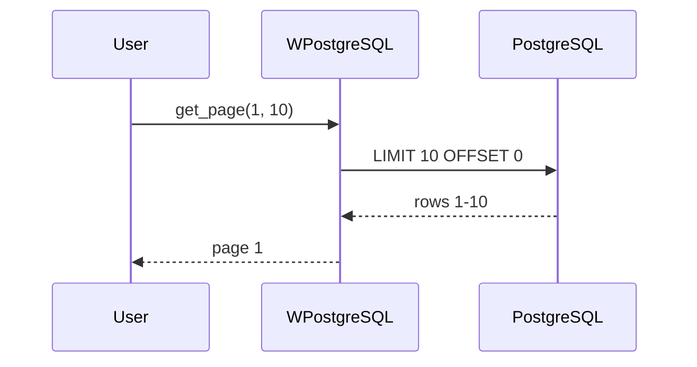
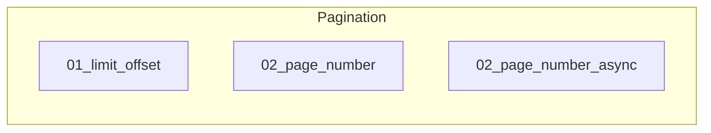

# 04 - Pagination

This folder contains examples of how to implement **pagination** for query results with **wpostgresql**.

---

## 1. 🚶 Diagram Walkthrough


## 2. 🗺️ System Workflow



## 3. 🏗️ Architecture Components



## 4. ⚙️ Container Lifecycle

### Build Process
- Example written

### Runtime Process
1. User requests page
2. Calculate offset
3. Query with LIMIT/OFFSET
4. Return results

## 5. 📂 File-by-File Guide

| Folder | Purpose |
|--------|---------|
| `01_limit_offset/` | LIMIT/OFFSET pagination |
| `02_page_number/` | Page-number pagination |
| `02_page_number_async/` | Async pagination |

---

## Contents

| Folder | Description |
|--------|-------------|
| [01_limit_offset](01_limit_offset/) | LIMIT/OFFSET pagination |
| [02_page_number](02_page_number/) | Page-number based pagination |
| [02_page_number_async](02_page_number_async/) | Async pagination |

## Pagination Methods

### LIMIT/OFFSET

```python
# Get first 10 records
results = db.get_paginated(limit=10, offset=0)

# Get next 10 records
results = db.get_paginated(limit=10, offset=10)
```

### Page Number

```python
# Get page 1 with 10 items per page
page1 = db.get_page(page=1, per_page=10)

# Get page 2 with 10 items per page
page2 = db.get_page(page=2, per_page=10)
```

## Author

**William Rodríguez** - [wisrovi](mailto:wisrovi.rodriguez@gmail.com)

Technology Evangelist & Software Architect

LinkedIn: [William Rodríguez](https://www.linkedin.com/in/william-rodriguez-villamizar-572302207)
