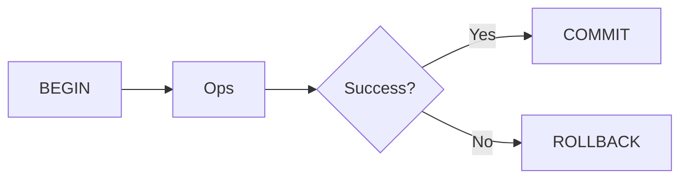
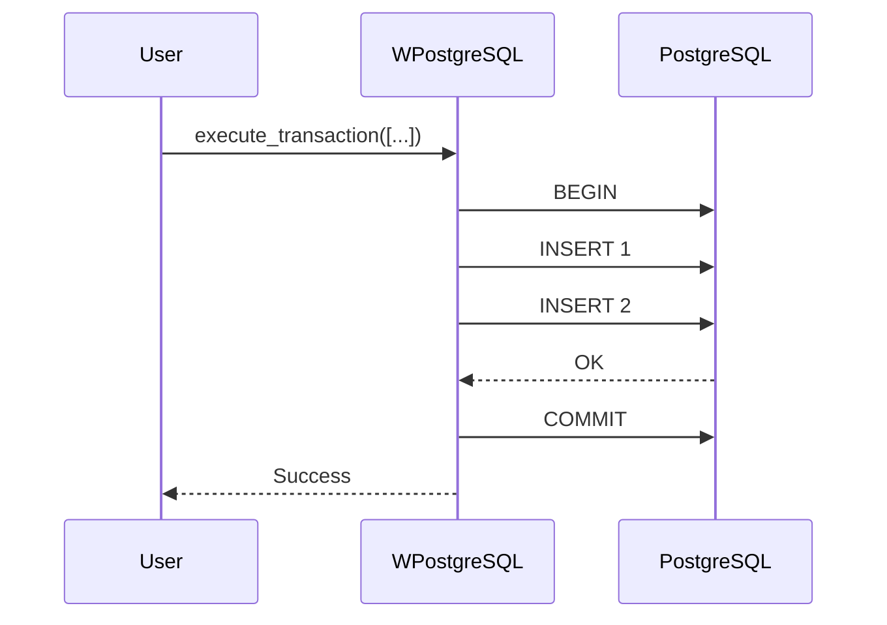
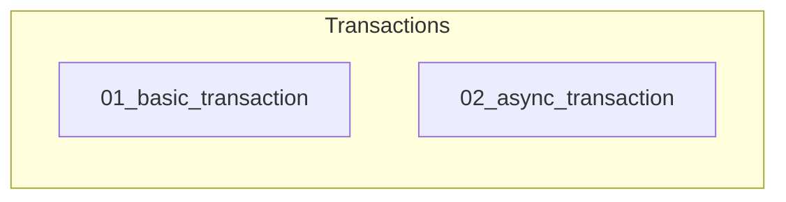

# 05 - Transactions

This folder contains examples of how to use **transactions** with **wpostgresql**, including commit and rollback handling.

---

## 1. 🚶 Diagram Walkthrough

## 2. 🗺️ System Workflow

## 3. 🏗️ Architecture Components

## 4. ⚙️ Container Lifecycle

### Build Process
- Example code written

### Runtime Process
1. User calls transaction method
2. BEGIN executed
3. All operations run
4. On success: COMMIT
5. On error: ROLLBACK

## 5. 📂 File-by-File Guide

| Folder | Purpose |
|--------|---------|
| `01_basic_transaction/` | Sync transactions |
| `02_async_transaction/` | Async transactions |

---

## Contents

| Folder | Description |
|--------|-------------|
| [01_basic_transaction](01_basic_transaction/) | Synchronous transaction examples |
| [02_async_transaction](02_async_transaction/) | Asynchronous transaction examples |

## Author

**William Rodríguez** - [wisrovi](mailto:wisrovi.rodriguez@gmail.com)

Technology Evangelist & Software Architect

LinkedIn: [William Rodríguez](https://www.linkedin.com/in/william-rodriguez-villamizar-572302207)
