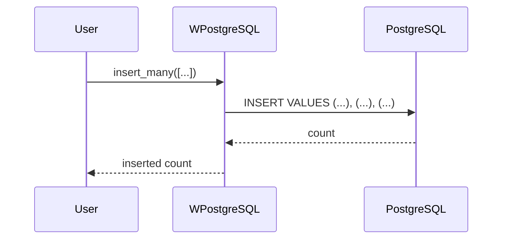
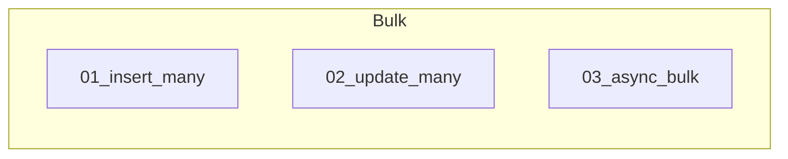

# 06 - Bulk Operations

This folder contains examples of how to perform **bulk operations** with **wpostgresql** to efficiently insert, update, or delete multiple records.

---

## 1. 🚶 Diagram Walkthrough

## 2. 🗺️ System Workflow

## 3. 🏗️ Architecture Components

## 4. ⚙️ Container Lifecycle

### Build Process
- Example written

### Runtime Process
1. User provides list
2. Batch SQL constructed
3. Single query executed
4. Count returned

## 5. 📂 File-by-File Guide

| Folder | Purpose |
|--------|---------|
| `01_insert_many/` | Bulk insert |
| `02_update_many/` | Bulk update |
| `03_async_bulk/` | Async bulk |

---

## Contents

| Folder | Description |
|--------|-------------|
| [01_insert_many](01_insert_many/) | Bulk insert examples |
| [02_update_many](02_update_many/) | Bulk update examples |
| [03_async_bulk](03_async_bulk/) | Async bulk operations |

## Author

**William Rodríguez** - [wisrovi](mailto:wisrovi.rodriguez@gmail.com)

Technology Evangelist & Software Architect

LinkedIn: [William Rodríguez](https://www.linkedin.com/in/william-rodriguez-villamizar-572302207)
