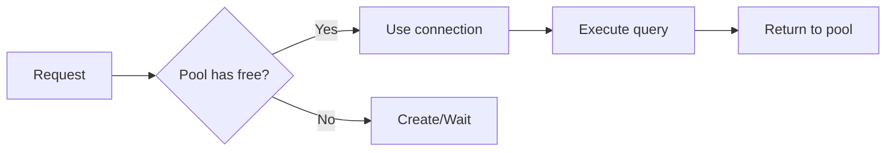
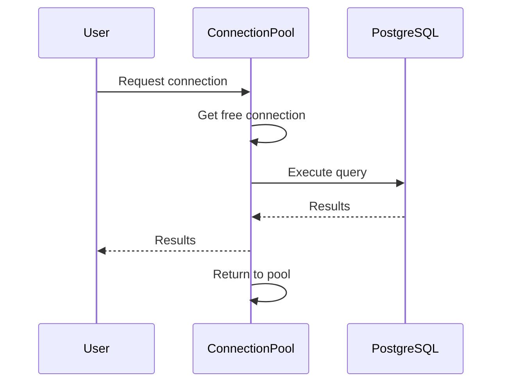
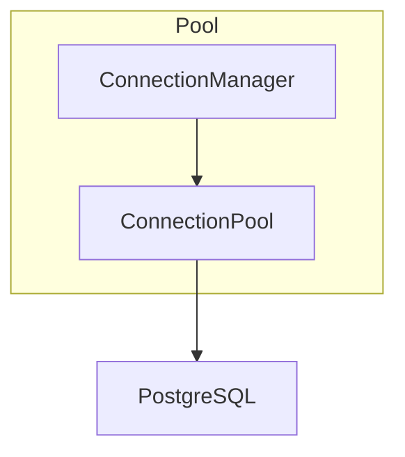

# 07 - Connection Pooling

This folder contains examples of how to use **connection pooling** with **wpostgresql** to manage database connections efficiently.

---

## 1. 🚶 Diagram Walkthrough

## 2. 🗺️ System Workflow

## 3. 🏗️ Architecture Components

## 4. ⚙️ Container Lifecycle

### Build Process
- Example written

### Runtime Process
1. Pool initialized with config
2. Requests managed automatically
3. Connections reused
4. Pool cleaned up on exit

## 5. 📂 File-by-File Guide

| Folder | Purpose |
|--------|---------|
| `01_simple_pool/` | Basic pool usage |

---

## Contents

| Folder | Description |
|--------|-------------|
| [01_simple_pool](01_simple_pool/) | Basic connection pool usage |

## Author

**William Rodríguez** - [wisrovi](mailto:wisrovi.rodriguez@gmail.com)

Technology Evangelist & Software Architect

LinkedIn: [William Rodríguez](https://www.linkedin.com/in/william-rodriguez-villamizar-572302207)
