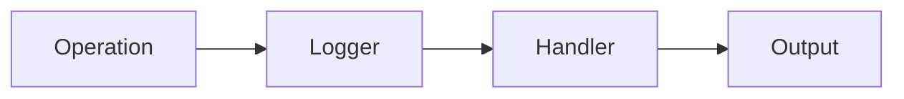
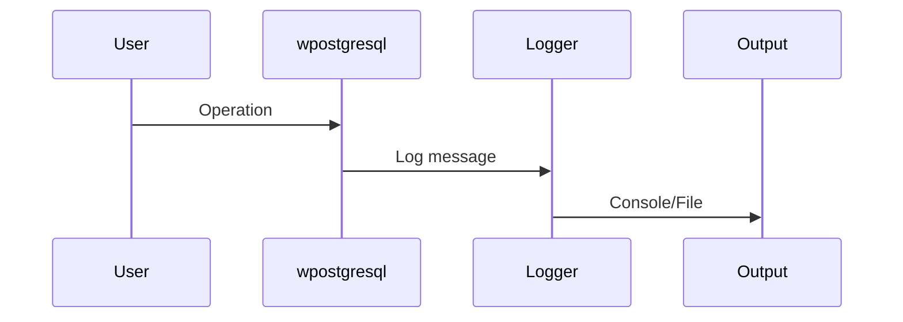
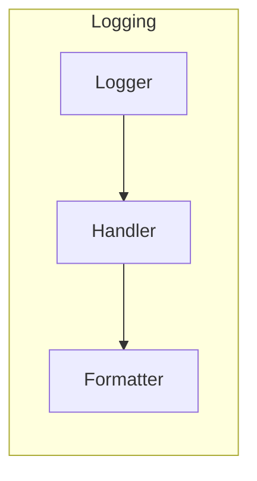

# 08 - Logging

This folder contains examples of how to configure and use **logging** with **wpostgresql** to obtain information about database operations.

---

## 1. 🚶 Diagram Walkthrough

## 2. 🗺️ System Workflow

## 3. 🏗️ Architecture Components

## 4. ⚙️ Container Lifecycle

### Build Process
- Loguru configured in app
- Handlers set up

### Runtime Process
1. Operation executes
2. Logger captures event
3. Formatted output
4. Sent to handler

## 5. 📂 File-by-File Guide

| Folder | Purpose |
|--------|---------|
| `01_basic_logging/` | Basic logging setup |

---

## Contents

| Folder | Description |
|--------|-------------|
| [01_basic_logging](01_basic_logging/) | Basic logging configuration |

## Author

**William Rodríguez** - [wisrovi](mailto:wisrovi.rodriguez@gmail.com)

Technology Evangelist & Software Architect

LinkedIn: [William Rodríguez](https://www.linkedin.com/in/william-rodriguez-villamizar-572302207)
