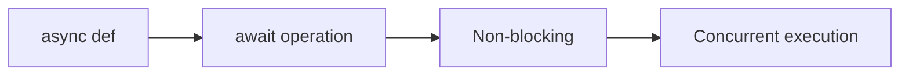
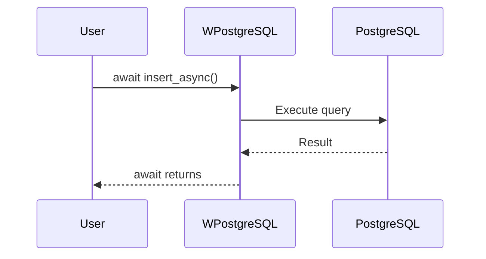
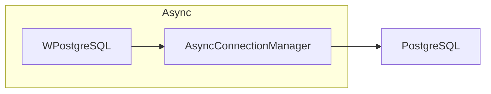

# 09 - Async Operations

This folder contains examples of how to use the **async API** of **wpostgresql** for non-blocking database operations.

---

## 1. 🚶 Diagram Walkthrough

## 2. 🗺️ System Workflow

## 3. 🏗️ Architecture Components

## 4. ⚙️ Container Lifecycle

### Build Process
- Async methods available

### Runtime Process
1. User calls async method
2. Event loop continues
3. Query executes
4. Results await returned

## 5. 📂 File-by-File Guide

| Folder | Purpose |
|--------|---------|
| `01_basic_async/` | Basic async usage |

---

## Contents

| Folder | Description |
|--------|-------------|
| [01_basic_async](01_basic_async/) | Basic async operations |

## Author

**William Rodríguez** - [wisrovi](mailto:wisrovi.rodriguez@gmail.com)

Technology Evangelist & Software Architect

LinkedIn: [William Rodríguez](https://www.linkedin.com/in/william-rodriguez-villamizar-572302207)
