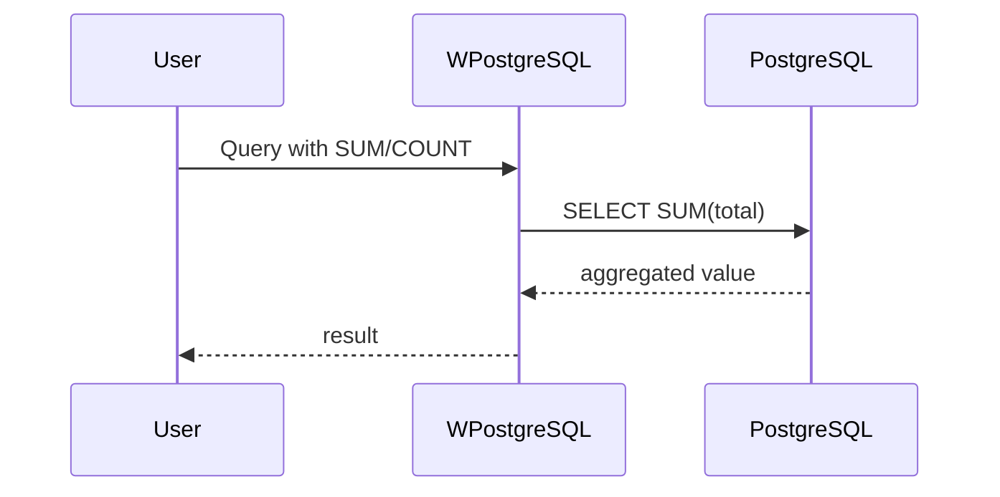
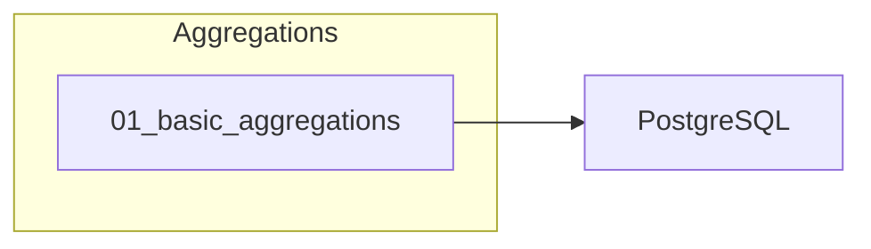

# 10 - Aggregations

This folder contains examples of how to use **aggregation functions** (COUNT, SUM, AVG, MAX, MIN) with **wpostgresql**.

---

## 1. 🚶 Diagram Walkthrough

```mermaid
flowchart LR
    A[SELECT agg()] --> B[GROUP BY]
    B --> C[Aggregate]
```

## 2. 🗺️ System Workflow



## 3. 🏗️ Architecture Components



## 4. ⚙️ Container Lifecycle

### Build Process
- Example written

### Runtime Process
1. User builds query
2. Aggregate function added
3. PostgreSQL computes
4. Result returned

## 5. 📂 File-by-File Guide

| Folder | Purpose |
|--------|---------|
| `01_basic_aggregations/` | Aggregation queries |

---

## Contents

| Folder | Description |
|--------|-------------|
| [01_basic_aggregations](01_basic_aggregations/) | Basic aggregation queries |

## Author

**William Rodríguez** - [wisrovi](mailto:wisrovi.rodriguez@gmail.com)

Technology Evangelist & Software Architect

LinkedIn: [William Rodríguez](https://www.linkedin.com/in/william-rodriguez-villamizar-572302207)
