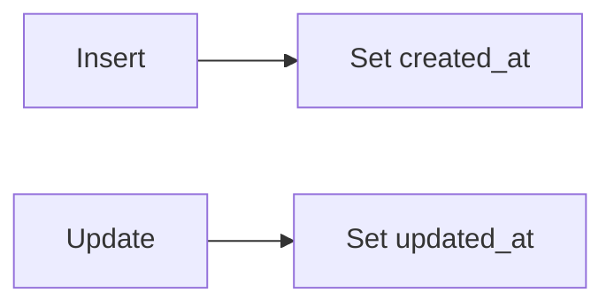
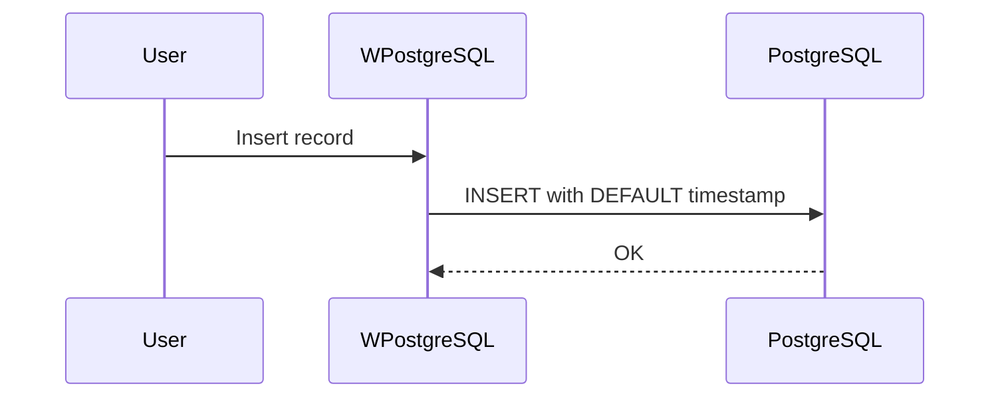
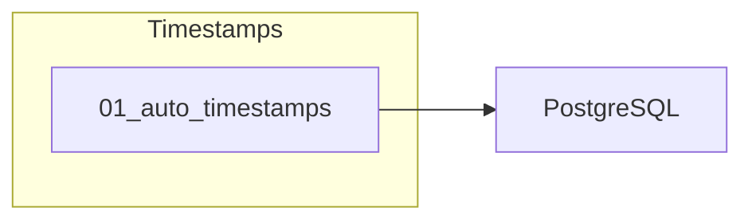

# 11 - Timestamps

This folder contains examples of how to handle **timestamps** (created_at, updated_at) automatically with **wpostgresql**.

---

## 1. 🚶 Diagram Walkthrough

## 2. 🗺️ System Workflow

## 3. 🏗️ Architecture Components

## 4. ⚙️ Container Lifecycle

### Build Process
- Example written

### Runtime Process
1. User creates record
2. Timestamp field auto-set
3. PostgreSQL handles defaults

## 5. 📂 File-by-File Guide

| Folder | Purpose |
|--------|---------|
| `01_auto_timestamps/` | Auto timestamp handling |

---

## Contents

| Folder | Description |
|--------|-------------|
| [01_auto_timestamps](01_auto_timestamps/) | Automatic timestamp examples |

## Author

**William Rodríguez** - [wisrovi](mailto:wisrovi.rodriguez@gmail.com)

Technology Evangelist & Software Architect

LinkedIn: [William Rodríguez](https://www.linkedin.com/in/william-rodriguez-villamizar-572302207)
