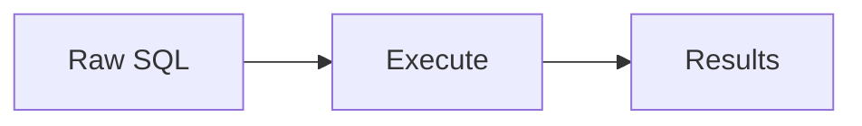
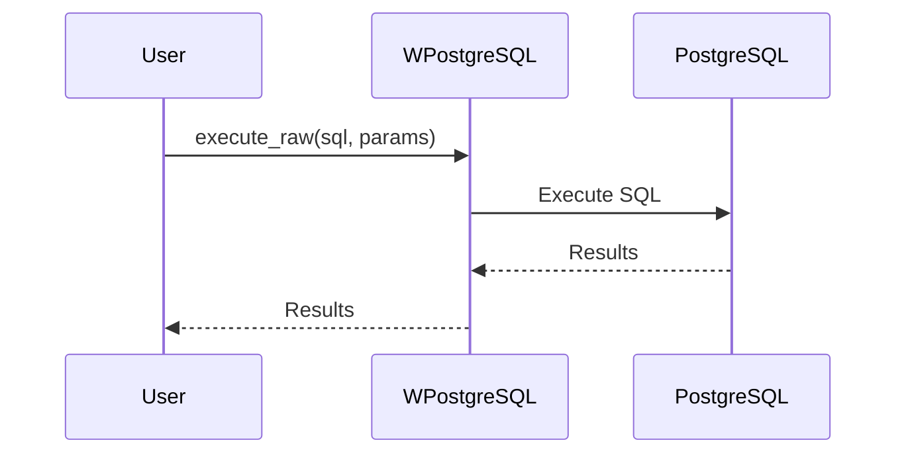
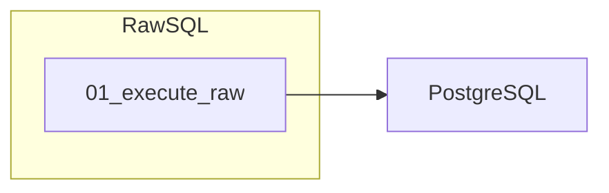

# 12 - Raw SQL

This folder contains examples of how to execute **raw SQL** with **wpostgresql** when more control or complex queries are needed.

---

## 1. 🚶 Diagram Walkthrough

## 2. 🗺️ System Workflow

## 3. 🏗️ Architecture Components

## 4. ⚙️ Container Lifecycle

### Build Process
- Example written

### Runtime Process
1. User writes SQL
2. Parameters validated
3. Query executed
4. Results returned

## 5. 📂 File-by-File Guide

| Folder | Purpose |
|--------|---------|
| `01_execute_raw/` | Direct SQL execution |

---

## Contents

| Folder | Description |
|--------|-------------|
| [01_execute_raw](01_execute_raw/) | Direct SQL execution examples |

## Author

**William Rodríguez** - [wisrovi](mailto:wisrovi.rodriguez@gmail.com)

Technology Evangelist & Software Architect

LinkedIn: [William Rodríguez](https://www.linkedin.com/in/william-rodriguez-villamizar-572302207)
