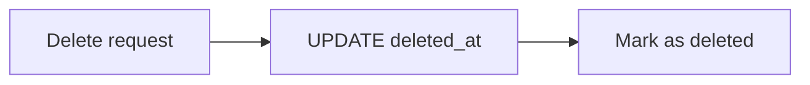
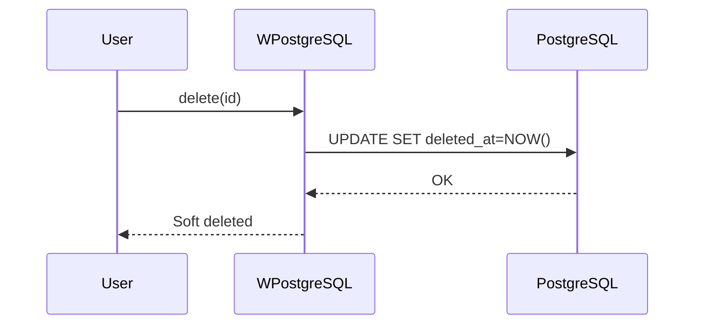
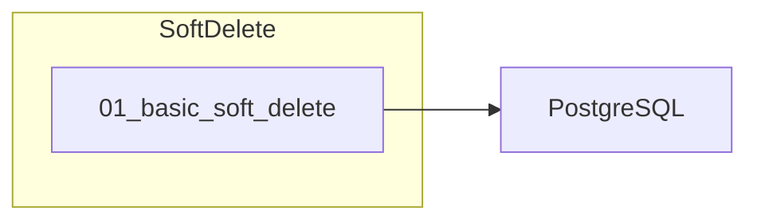

# 13 - Soft Delete

This folder contains examples of how to implement **soft delete** with **wpostgresql**, where records are marked as deleted instead of being physically removed.

---

## 1. 🚶 Diagram Walkthrough

## 2. 🗺️ System Workflow

## 3. 🏗️ Architecture Components

## 4. ⚙️ Container Lifecycle

### Build Process
- Example written

### Runtime Process
1. User calls delete
2. Record updated (not removed)
3. deleted_at timestamp set
4. Filtered in queries

## 5. 📂 File-by-File Guide

| Folder | Purpose |
|--------|---------|
| `01_basic_soft_delete/` | Soft delete pattern |

---

## Contents

| Folder | Description |
|--------|-------------|
| [01_basic_soft_delete](01_basic_soft_delete/) | Soft delete implementation examples |

## Author

**William Rodríguez** - [wisrovi](mailto:wisrovi.rodriguez@gmail.com)

Technology Evangelist & Software Architect

LinkedIn: [William Rodríguez](https://www.linkedin.com/in/william-rodriguez-villamizar-572302207)
