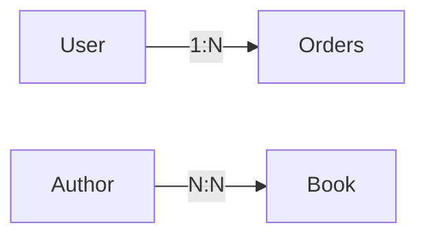
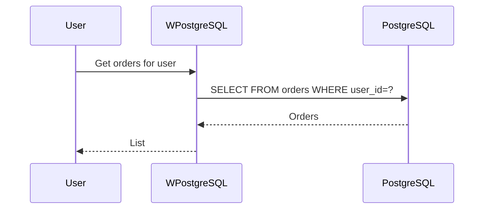
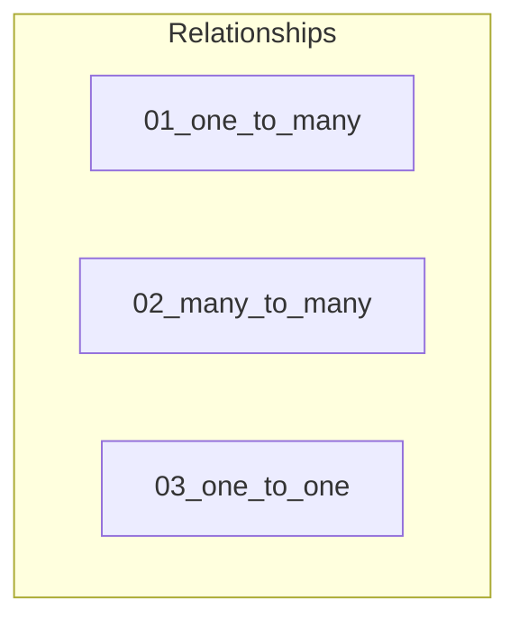

# 14 - Relationships

This folder contains examples of how to handle **table relationships** (one-to-one, one-to-many, many-to-many) with **wpostgresql**.

---

## 1. 🚶 Diagram Walkthrough

## 2. 🗺️ System Workflow

## 3. 🏗️ Architecture Components

## 4. ⚙️ Container Lifecycle

### Build Process
- Examples written

### Runtime Process
1. User defines models with FK
2. Tables created with relationships
3. Query with JOINs
4. Related data returned

## 5. 📂 File-by-File Guide

| Folder | Purpose |
|--------|---------|
| `01_one_to_many/` | One-to-many |
| `02_many_to_many/` | Many-to-many |
| `03_one_to_one/` | One-to-one |

---

## Contents

| Folder | Description |
|--------|-------------|
| [01_one_to_many](01_one_to_many/) | One-to-many relationship examples |
| [02_many_to_many](02_many_to_many/) | Many-to-many relationship examples |
| [03_one_to_one](03_one_to_one/) | One-to-one relationship examples |

## Author

**William Rodríguez** - [wisrovi](mailto:wisrovi.rodriguez@gmail.com)

Technology Evangelist & Software Architect

LinkedIn: [William Rodríguez](https://www.linkedin.com/in/william-rodriguez-villamizar-572302207)
