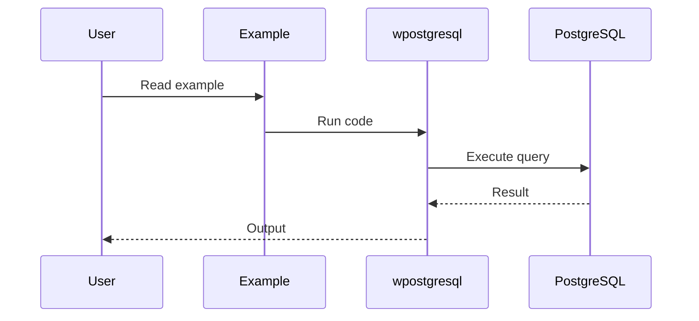
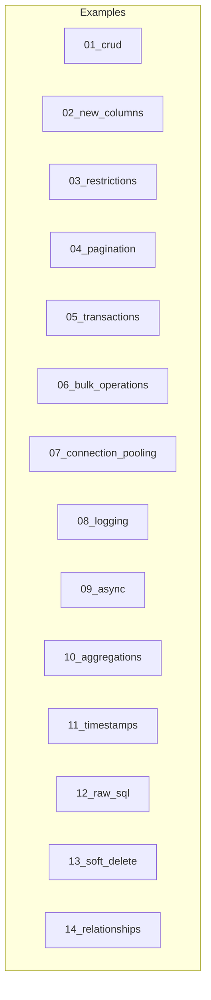

# Examples - wpostgresql

Collection of examples and tests organized by features to learn how to use the library.

## General Structure

```
examples/
├── README.md              # This file
├── test/                  # Integration tests
│   ├── conftest.py
│   ├── 01_crud/
│   ├── 02_new_columns/
│   └── 03_restrictions/
├── 01_crud/              # CRUD examples
├── 02_new_columns/      # Dynamic column examples
├── 03_restrictions/      # Constraint examples
├── 04_pagination/        # Pagination
├── 05_transactions/      # Transactions
├── 06_bulk_operations/  # Bulk operations
├── 07_connection_pooling/ # Connection pooling
├── 08_logging/          # Logging
├── 09_async/            # Async/Await
├── 10_aggregations/      # Aggregations
├── 11_timestamps/        # Timestamps
├── 12_raw_sql/           # Raw SQL
├── 13_soft_delete/       # Soft delete
└── 14_relationships/    # Table relationships
```

---

## 1. 🚶 Diagram Walkthrough


## 2. 🗺️ System Workflow



## 3. 🏗️ Architecture Components



## 4. ⚙️ Container Lifecycle

### Build Process
- Examples written in Python
- Organized by topic

### Runtime Process
1. User selects example folder
2. Reads README.md
3. Runs example.py
4. Modifies for own use

## 5. 📂 File-by-File Guide

| Folder | Purpose |
|--------|---------|
| `01_crud/` | Create, Read, Update, Delete |
| `02_new_columns/` | Add columns to tables |
| `03_restrictions/` | PK, UNIQUE, NOT NULL |
| `04_pagination/` | LIMIT/OFFSET, page numbers |
| `05_transactions/` | Atomic operations |
| `06_bulk_operations/` | Mass insert/update/delete |
| `07_connection_pooling/` | Connection management |
| `08_logging/` | Logging configuration |
| `09_async/` | Async/await patterns |
| `10_aggregations/` | COUNT, SUM, AVG |
| `11_timestamps/` | Auto timestamps |
| `12_raw_sql/` | Raw SQL execution |
| `13_soft_delete/` | Soft delete pattern |
| `14_relationships/` | Table relationships |

---

## Examples (For Learning)

### 01_crud - Basic Operations
| Example | Description |
|---------|-------------|
| [01_create](./01_crud/01_create/) | Insert new records |
| [02_read](./01_crud/02_read/) | Query records |
| [03_update](./01_crud/03_update/) | Update records |
| [04_delete](./01_crud/04_delete/) | Delete records |

### 02_new_columns - Dynamic Columns
| Example | Description |
|---------|-------------|
| [01_add_column](./02_new_columns/01_add_column/) | Add new columns to model |

### 03_restrictions - Data Constraints
| Example | Description |
|---------|-------------|
| [01_primary_key](./03_restrictions/01_primary_key/) | Primary key (prevent duplicates) |
| [02_unique](./03_restrictions/02_unique/) | Unique values |
| [03_not_null](./03_restrictions/03_not_null/) | Required fields |

### 04_pagination - Pagination
| Example | Description |
|---------|-------------|
| [01_limit_offset](./04_pagination/01_limit_offset/) | Limit and offset results |
| [02_page_number](./04_pagination/02_page_number/) | Page number pagination |

### 05_transactions - Transactions
| Example | Description |
|---------|-------------|
| [01_basic_transaction](./05_transactions/01_basic_transaction/) | Atomic transactions |

### 06_bulk_operations - Bulk Operations
| Example | Description |
|---------|-------------|
| [01_insert_many](./06_bulk_operations/01_insert_many/) | Insert multiple records |
| [02_update_many](./06_bulk_operations/02_update_many/) | Update multiple records |

### 07_connection_pooling - Connection Pooling
| Example | Description |
|---------|-------------|
| [01_simple_pool](./07_connection_pooling/01_simple_pool/) | Configure connection pooling |

### 08_logging - Logging
| Example | Description |
|---------|-------------|
| [01_basic_logging](./08_logging/01_basic_logging/) | Configure logging |

### 09_async - Async / Await ⭐ (NEW v0.3.0)
| Example | Description |
|---------|-------------|
| [01_basic_async](./09_async/01_basic_async/) | Async version of the library |

---

## Requirements

- Python 3.9+
- PostgreSQL
- Libraries: `wpostgresql`, `pydantic`, `psycopg`, `psycopg_pool`, `pytest`

### Start Database

```bash
cd docker
docker-compose up -d
```

### Install Dependencies

```bash
pip install -e ".[dev]"
```

---

## Async Example (v0.3.0)

```python
import asyncio
from pydantic import BaseModel
from wpostgresql import WPostgreSQL

class User(BaseModel):
    id: int
    name: str
    email: str

async def main():
    db = WPostgreSQL(User, db_config)
    
    # Async CRUD
    await db.insert_async(User(id=1, name="John", email="john@example.com"))
    users = await db.get_all_async()
    await db.update_async(1, User(id=1, name="John", email="john@example.com"))
    await db.delete_async(1)

asyncio.run(main())
```

## Author

**William Rodríguez** - [wisrovi](mailto:wisrovi.rodriguez@gmail.com)

Technology Evangelist & Software Architect

LinkedIn: [William Rodríguez](https://www.linkedin.com/in/william-rodriguez-villamizar-572302207)
