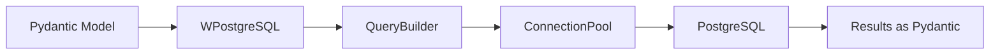
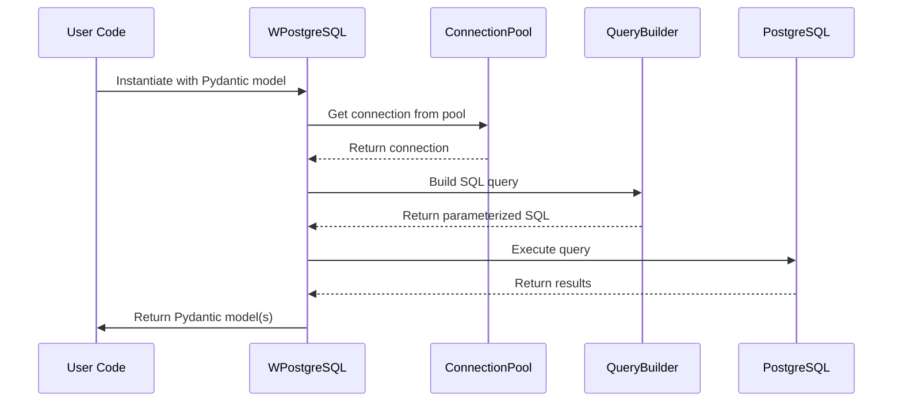
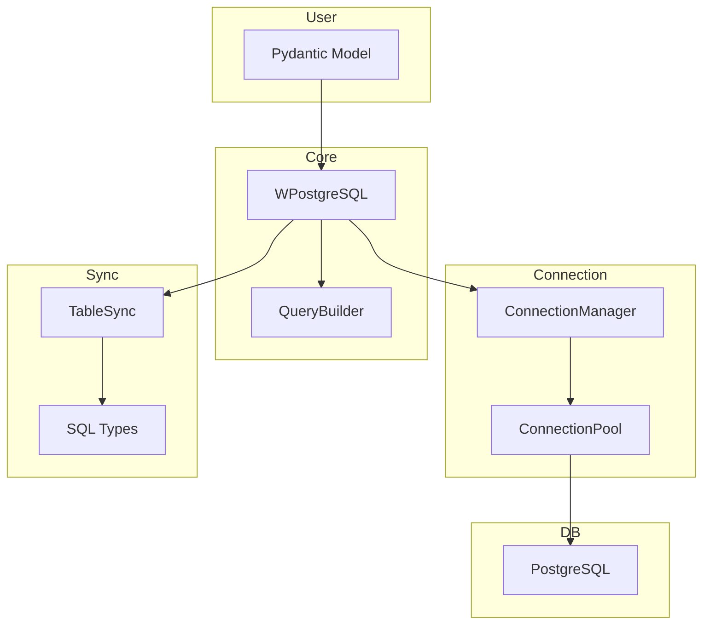

# Source Code

This directory contains the source code for **wpostgresql**, a PostgreSQL ORM (Object-Relational Mapping) library that uses Pydantic models for database schema definition.

## Architecture Overview

The codebase follows a modular architecture with clear separation of concerns:

```
src/wpostgresql/
├── __init__.py           # Public API exports
├── builders/             # SQL query construction
│   ├── __init__.py
│   └── query_builder.py
├── cli/                  # Command-line interface
│   ├── __init__.py
│   └── main.py
├── core/                 # ORM core functionality
│   ├── __init__.py
│   ├── connection.py    # Connection pooling & management
│   ├── repository.py    # WPostgreSQL main class
│   └── sync.py          # Table synchronization
├── exceptions/           # Custom exceptions
│   └── __init__.py
└── types/                # Type mapping utilities
    ├── __init__.py
    └── sql_types.py
```

---

## 1. 🚶 Diagram Walkthrough



## 2. 🗺️ System Workflow



## 3. 🏗️ Architecture Components



## 4. ⚙️ Container Lifecycle

### Build Process
- Source files compiled by Python
- Dependencies resolved from pyproject.toml
- Package installed via pip

### Runtime Process
1. User instantiates WPostgreSQL with Pydantic model
2. Connection pool initialized
3. TableSync checks/creates schema
4. Queries built via QueryBuilder
5. Results validated and returned as Pydantic models

## 5. 📂 File-by-File Guide

| File/Folder | Purpose |
|-------------|---------|
| `__init__.py` | Public API exports, version |
| `core/connection.py` | Connection pooling, transactions |
| `core/repository.py` | WPostgreSQL class, CRUD operations |
| `core/sync.py` | Table synchronization from models |
| `builders/query_builder.py` | Safe SQL query construction |
| `cli/main.py` | CLI tool using Click |
| `exceptions/__init__.py` | Custom exception hierarchy |
| `types/sql_types.py` | Pydantic to PostgreSQL mapping |

---

## Module Description

### core/
The heart of the ORM, containing:
- **connection.py** — Connection pooling (sync & async), transaction management
- **repository.py** — `WPostgreSQL` class with all CRUD operations
- **sync.py** — Table synchronization from Pydantic models

### builders/
- **query_builder.py** — Safe SQL query construction with injection prevention

### cli/
- **main.py** — CLI tool for database management tasks

### exceptions/
Custom exception hierarchy:
- `WPostgreSQLError` (base)
- `ConnectionError`
- `TableSyncError`
- `ValidationError`
- `OperationError`
- `SQLInjectionError`
- `TransactionError`

### types/
- **sql_types.py** — Pydantic to PostgreSQL type mapping

## Public API

```python
from wpostgresql import (
    WPostgreSQL,
    QueryBuilder,
    ConnectionManager,
    AsyncConnectionManager,
    Transaction,
    AsyncTransaction,
    TableSync,
    AsyncTableSync,
    # Exceptions
    WPostgreSQLError,
    ConnectionError,
    TableSyncError,
    ValidationError,
    OperationError,
    SQLInjectionError,
    TransactionError,
)
```

## Usage

```python
from pydantic import BaseModel
from wpostgresql import WPostgreSQL

class User(BaseModel):
    id: int
    name: str
    email: str

db = WPostgreSQL(User, db_config)
db.insert(User(id=1, name="John", email="john@example.com"))
```

## Dependencies

From `pyproject.toml`:
- `psycopg[binary]>=3.1.0` — PostgreSQL driver
- `psycopg_pool>=3.1.0` — Connection pooling
- `pydantic>=2.0.0` — Data validation
- `loguru>=0.7.0` — Logging
- `click>=8.0.0` — CLI framework

## Author

**William Rodríguez** - [wisrovi](mailto:wisrovi.rodriguez@gmail.com)

Technology Evangelist & Software Architect

LinkedIn: [William Rodríguez](https://www.linkedin.com/in/william-rodriguez-villamizar-572302207)
