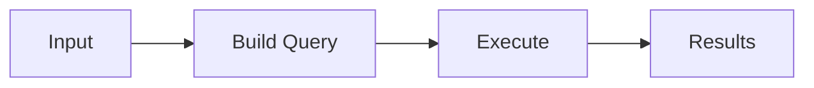
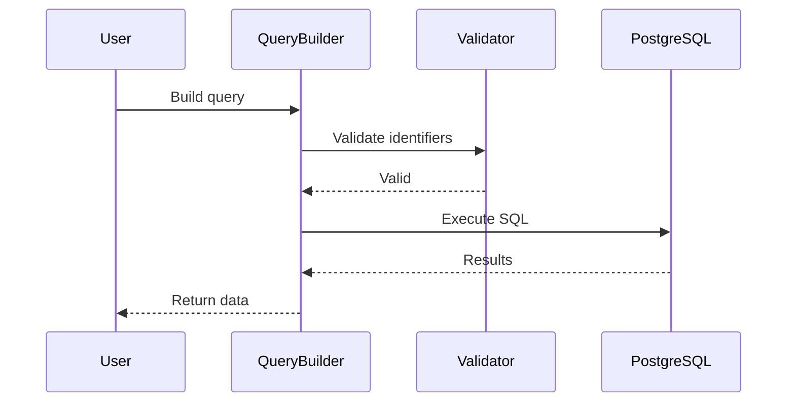
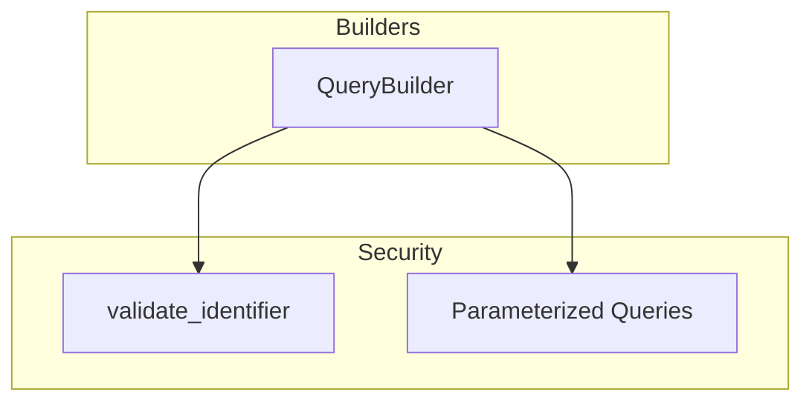
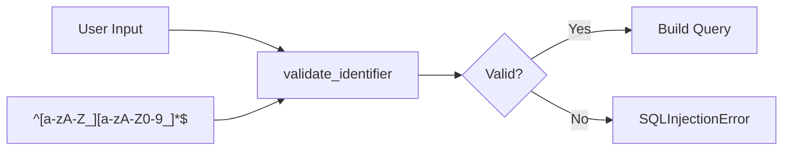

# Builders

This module provides the `QueryBuilder` class for constructing dynamic, safe SQL queries programmatically.

## Overview

The QueryBuilder enables building SQL statements (SELECT, INSERT, UPDATE, DELETE) safely with built-in SQL injection prevention through identifier validation.

---

## 1. 🚶 Diagram Walkthrough



## 2. 🗺️ System Workflow



## 3. 🏗️ Architecture Components



## 4. ⚙️ Container Lifecycle

### Build Process
- Source compiled at import
- Methods available immediately

### Runtime Process
1. User creates QueryBuilder instance
2. Chains method calls
3. Builds final SQL with parameters
4. Returns to caller

## 5. 📂 File-by-File Guide

| File | Purpose |
|------|---------|
| `query_builder.py` | Safe SQL query construction |

---

## Components

### query_builder.py

```python
class QueryBuilder:
    """Safe SQL query construction with injection prevention."""
    
    def select(self, *fields)
    def where(self, condition, *values)
    def order_by(self, column, desc=False)
    def limit(self, value)
    def offset(self, value)
    def build(self) -> tuple[str, list]
```

## Security Features



- **Identifier Validation**: All table/column names validated against regex pattern
- **Parameterized Queries**: Values passed as parameters, never concatenated
- **Type Safety**: Full type hints for IDE support

## Usage

```python
from wpostgresql.builders import QueryBuilder

# SELECT query
query = QueryBuilder("users")
query.select("id", "name", "email").where("active = %s", True)
query.order_by("name").limit(10)
sql, params = query.build()
# sql: "SELECT id, name, email FROM users WHERE active = %s ORDER BY name LIMIT 10"
# params: [True]

# INSERT query
insert_query = QueryBuilder("products")
insert_query.insert({"name": "Widget", "price": 29.99})
sql, params = insert_query.build()

# UPDATE query
update_query = QueryBuilder("users")
update_query.update({"name": "Jane"}, "id = %s", 1)
```

## Integration

QueryBuilder is used internally by `WPostgreSQL` for all database operations. It can also be used directly for complex queries:

```python
from wpostgresql.builders import QueryBuilder

# Custom query with JOIN support
query = QueryBuilder("orders")
query.select("orders.id", "users.name", "orders.total")
query.where("orders.status = %s AND orders.total > %s", "pending", 100)
query.order_by("orders.created_at", desc=True)
```

## Author

**William Rodríguez** - [wisrovi](mailto:wisrovi.rodriguez@gmail.com)

Technology Evangelist & Software Architect

LinkedIn: [William Rodríguez](https://www.linkedin.com/in/william-rodriguez-villamizar-572302207)
