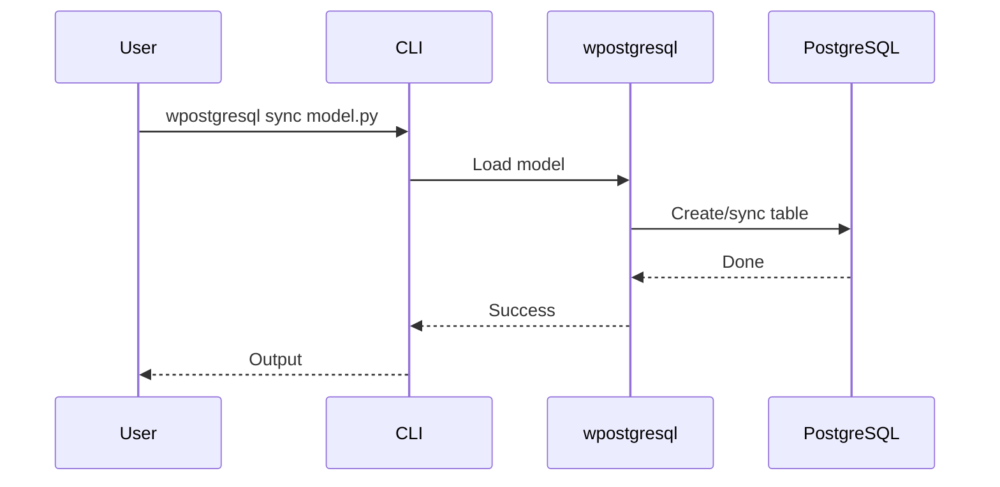
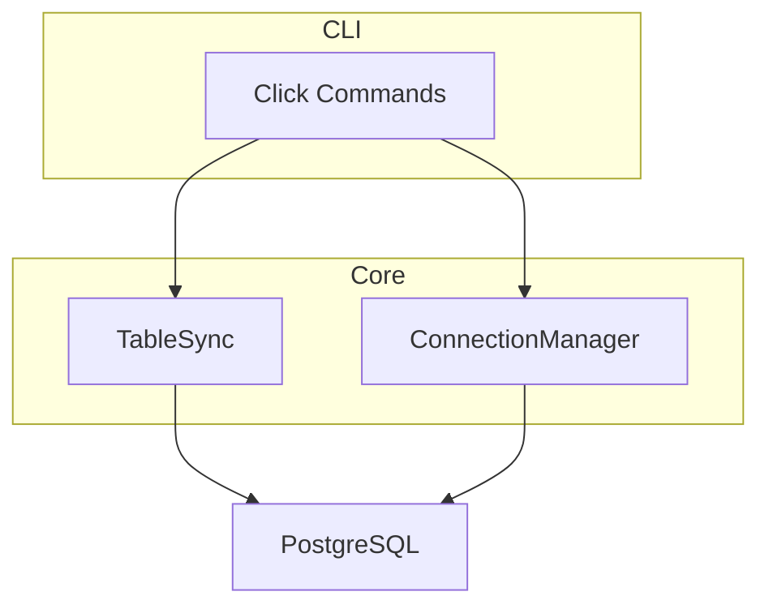
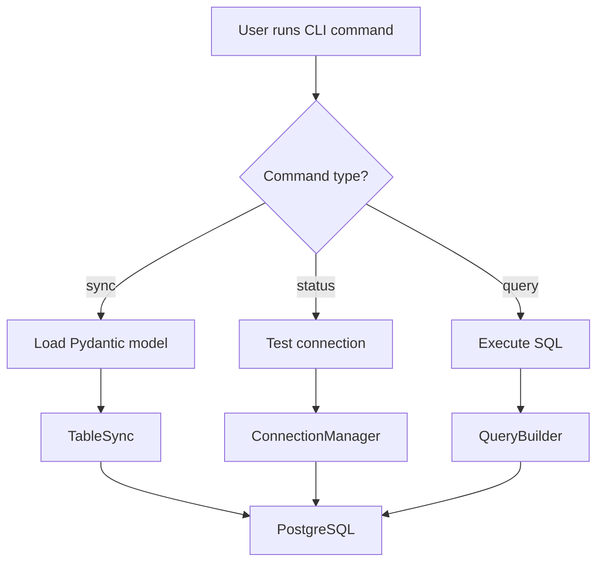

# CLI

This module provides a command-line interface (CLI) tool for managing database operations without writing Python code.

## Overview

The CLI is built with [Click](https://click.palletsprojects.com/) and enables:
- Table synchronization from Pydantic models
- Connection status verification
- CRUD operations from the terminal
- Model loading from Python files

---

## 1. 🚶 Diagram Walkthrough


## 2. 🗺️ System Workflow



## 3. 🏗️ Architecture Components



## 4. ⚙️ Container Lifecycle

### Build Process
- Installed as console script via pyproject.toml
- Entry point: wpostgresql.cli:main

### Runtime Process
1. User runs command
2. Click parses arguments
3. Loads configuration
4. Executes operation
5. Returns output

## 5. 📂 File-by-File Guide

| File | Purpose |
|------|---------|
| `main.py` | CLI implementation using Click |

---

## Commands

### Main Commands

```bash
# View help
wpostgresql --help

# Version info
wpostgresql --version
```

### Available Commands

| Command | Description |
|---------|-------------|
| `sync` | Synchronize table from Pydantic model |
| `status` | Check database connection status |
| `query` | Execute custom SQL queries |
| `insert` | Insert records from CLI |
| `list` | List records from a table |

## Usage Examples

### Sync Table

```bash
# Sync table from model file
wpostgresql sync path/to/model.py

# Sync with custom database config
wpostgresql sync path/to/model.py --config custom_config.yaml
```

### Check Status

```bash
# Verify database connection
wpostgresql status

# Verbose output
wpostgresql status -v
```

### Query Data

```bash
# Execute SELECT query
wpostgresql query "SELECT * FROM users WHERE active = true"

# Execute with parameters
wpostgresql query "SELECT * FROM orders WHERE total > ?" 100
```

## Configuration

### Environment Variables

```bash
export DB_HOST=localhost
export DB_PORT=5432
export DB_NAME=mydb
export DB_USER=postgres
export DB_PASSWORD=secret
```

### Config File

Create `~/.wpostgresql.yaml`:

```yaml
database:
  host: localhost
  port: 5432
  name: mydb
  user: postgres
  password: secret

pool:
  min_size: 2
  max_size: 20
```

## Workflow



## Integration

The CLI is automatically installed as a console script:

```bash
# After pip install wpostgresql
wpostgresql --help
```

## Author

**William Rodríguez** - [wisrovi](mailto:wisrovi.rodriguez@gmail.com)

Technology Evangelist & Software Architect

LinkedIn: [William Rodríguez](https://www.linkedin.com/in/william-rodriguez-villamizar-572302207)
