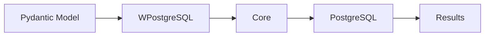
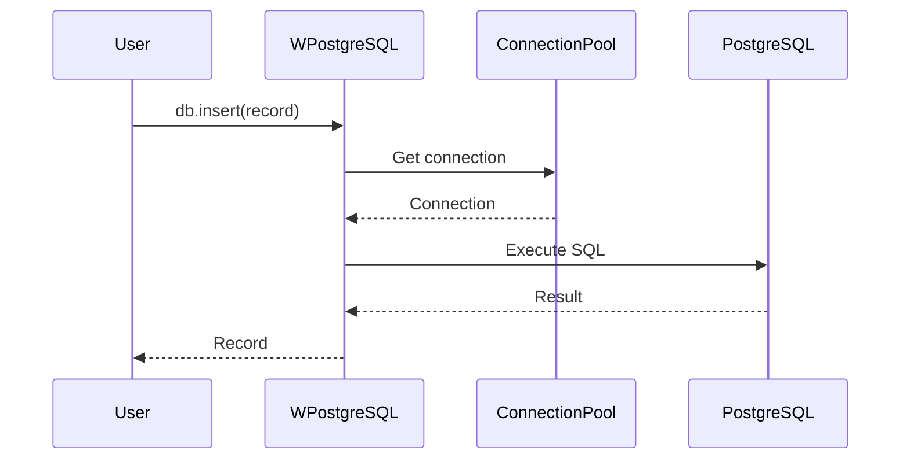
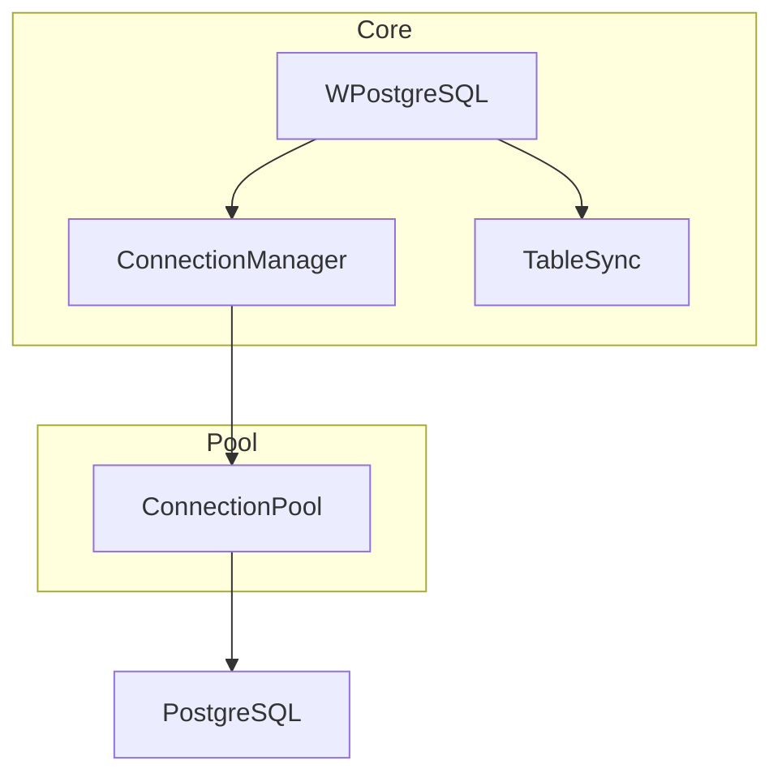
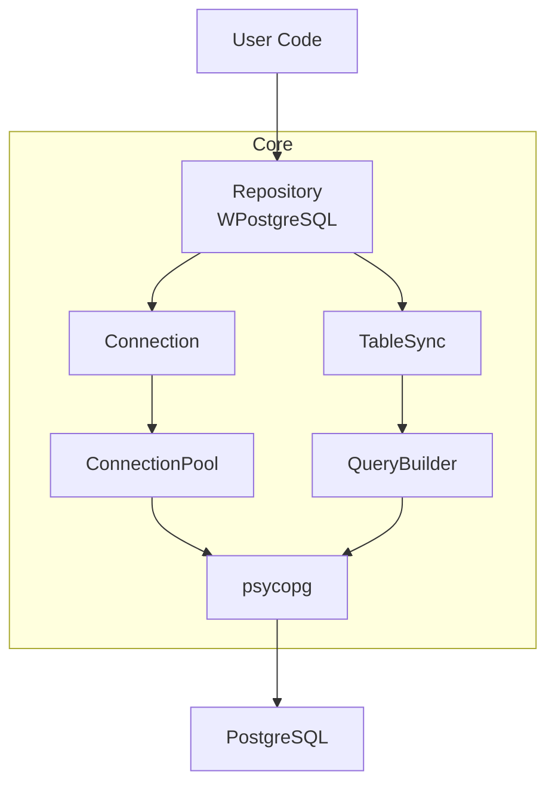

# Core

This module contains the heart of the **wpostgresql** ORM, including connection management, main repository, and table synchronization.

## Components

### connection.py

Manages database connections with pooling support:
- `ConnectionManager` — Synchronous connection pooling
- `AsyncConnectionManager` — Asynchronous connection pooling
- `Transaction` — Synchronous transaction context
- `AsyncTransaction` — Asynchronous transaction context

### repository.py

Implements the main `WPostgreSQL` class providing:
- All CRUD operations (insert, get, update, delete)
- Query methods (get_all, get_by_field, get_paginated, get_page)
- Bulk operations (insert_many, update_many, delete_many)
- Transaction execution

### sync.py

Schema synchronization:
- `TableSync` — Synchronous table sync from Pydantic models
- `AsyncTableSync` — Asynchronous table sync
- Automatic column creation and updates
- Index management

---

## 1. 🚶 Diagram Walkthrough



## 2. 🗺️ System Workflow



## 3. 🏗️ Architecture Components



## 4. ⚙️ Container Lifecycle

### Build Process
- Python compiles source files
- Package installed to environment

### Runtime Process
1. User instantiates WPostgreSQL
2. Connection pool created
3. Table schema synchronized
4. CRUD operations available
5. Pool manages connections

## 5. 📂 File-by-File Guide

| File | Purpose |
|------|---------|
| `connection.py` | Connection pooling, transactions |
| `repository.py` | WPostgreSQL class, CRUD |
| `sync.py` | Table sync, schema updates |

---

## Architecture



## Usage

```python
from wpostgresql import WPostgreSQL, ConnectionManager

# Basic connection
db = WPostgreSQL(MyModel, db_config)
db.insert(record)

# Global connection pool
conn_manager = ConnectionManager()
with conn_manager.get_connection() as conn:
    # Use connection directly
```

## Features

### Connection Pooling

```python
from wpostgresql import AsyncConnectionManager

pool_config = {"min_size": 2, "max_size": 20}
async_manager = AsyncConnectionManager(pool_config)

async with async_manager.get_connection() as conn:
    # Async operations
```

### Transactions

```python
# Synchronous
db.execute_transaction([
    lambda: db.insert(order1),
    lambda: db.insert(order2),
])

# Asynchronous
await db.execute_transaction_async([
    lambda: await db.insert_async(item1),
    lambda: await db.insert_async(item2),
])
```

### Table Sync

```python
from wpostgresql import TableSync

sync = TableSync(MyModel, db_config)
sync.create_if_not_exists()  # Create table
sync.sync_with_model()        # Update schema
```

## Author

**William Rodríguez** - [wisrovi](mailto:wisrovi.rodriguez@gmail.com)

Technology Evangelist & Software Architect

LinkedIn: [William Rodríguez](https://www.linkedin.com/in/william-rodriguez-villamizar-572302207)
