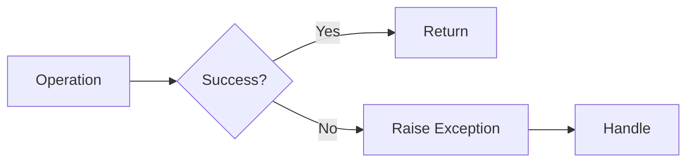
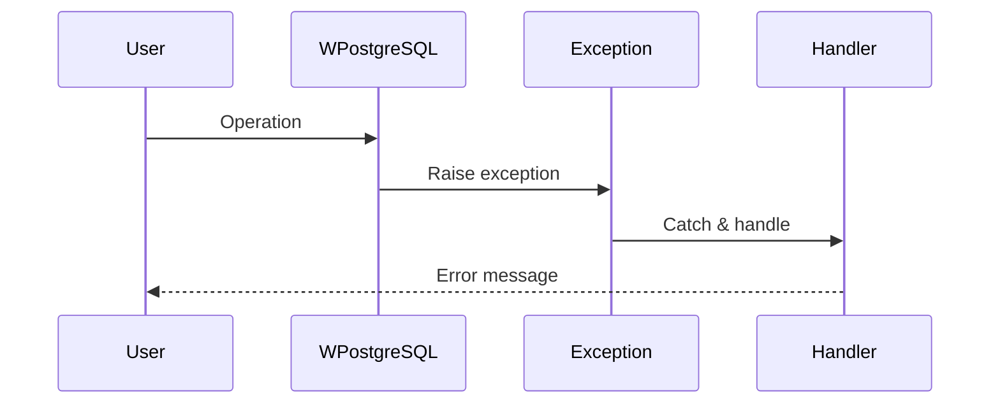
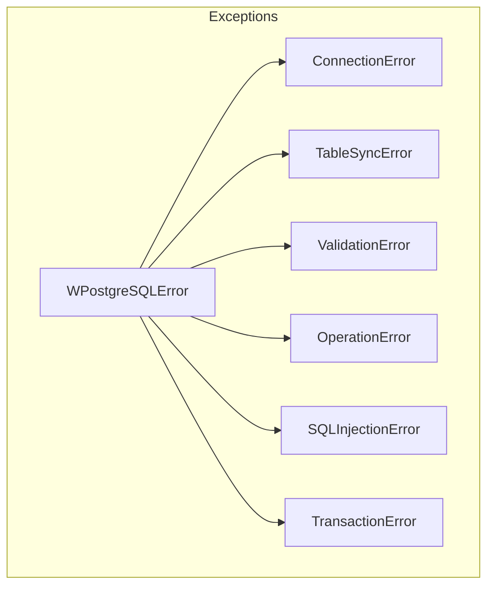
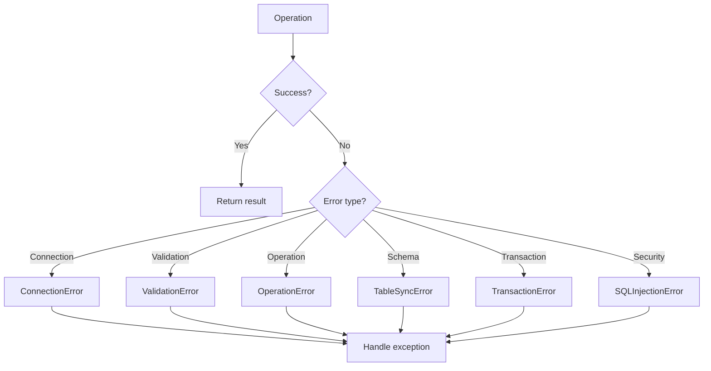

# Exceptions

This module defines custom exceptions used by **wpostgresql** for comprehensive error handling.

## Exception Hierarchy

```
WPostgreSQLError (Base)
├── ConnectionError
├── TableSyncError
├── ValidationError
├── OperationError
├── SQLInjectionError
└── TransactionError
```

---

## 1. 🚶 Diagram Walkthrough



## 2. 🗺️ System Workflow



## 3. 🏗️ Architecture Components



## 4. ⚙️ Container Lifecycle

### Build Process
- Exceptions defined at module import
- Available immediately to users

### Runtime Process
1. Operation executes
2. If error, raise specific exception
3. User catches and handles
4. Program can continue or exit

## 5. 📂 File-by-File Guide

| File | Purpose |
|------|---------|
| `__init__.py` | Exception classes definition |

---

## Exception Definitions

| Exception | Description | Raised When |
|-----------|-------------|-------------|
| `WPostgreSQLError` | Base exception for all wpostgresql errors | Any library error |
| `ConnectionError` | Database connection failures | Cannot connect to PostgreSQL |
| `TableSyncError` | Schema synchronization issues | Table creation/update fails |
| `ValidationError` | Data validation failures | Pydantic validation fails |
| `OperationError` | Database operation errors | CRUD operations fail |
| `SQLInjectionError` | SQL injection attempts detected | Invalid identifiers provided |
| `TransactionError` | Transaction failures | Commit/rollback errors |

## Usage

```python
from wpostgresql import WPostgreSQL
from wpostgresql.exceptions import (
    ConnectionError,
    TableSyncError,
    ValidationError,
    OperationError,
    SQLInjectionError,
    TransactionError,
)

try:
    db = WPostgreSQL(Model, db_config)
    db.insert(record)
except ConnectionError as e:
    print(f"Database connection failed: {e}")
except ValidationError as e:
    print(f"Data validation failed: {e}")
except SQLInjectionError as e:
    print(f"Security alert: {e}")
except OperationError as e:
    print(f"Database operation failed: {e}")
except TableSyncError as e:
    print(f"Schema sync failed: {e}")
except TransactionError as e:
    print(f"Transaction failed: {e}")
```

## Best Practices

```python
# Specific exception handling
try:
    db.insert(data)
except ValidationError as e:
    # Handle validation errors (invalid data format)
    log.error(f"Invalid data: {e}")
except ConnectionError as e:
    # Handle connection issues
    retry_connection()
except OperationError as e:
    # Handle database errors
    log.error(f"Operation failed: {e}")
```

## Error Flow



## Author

**William Rodríguez** - [wisrovi](mailto:wisrovi.rodriguez@gmail.com)

Technology Evangelist & Software Architect

LinkedIn: [William Rodríguez](https://www.linkedin.com/in/william-rodriguez-villamizar-572302207)
