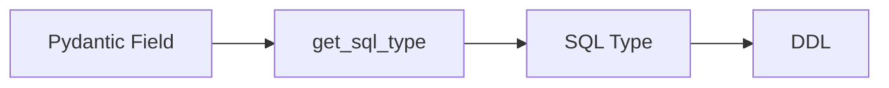
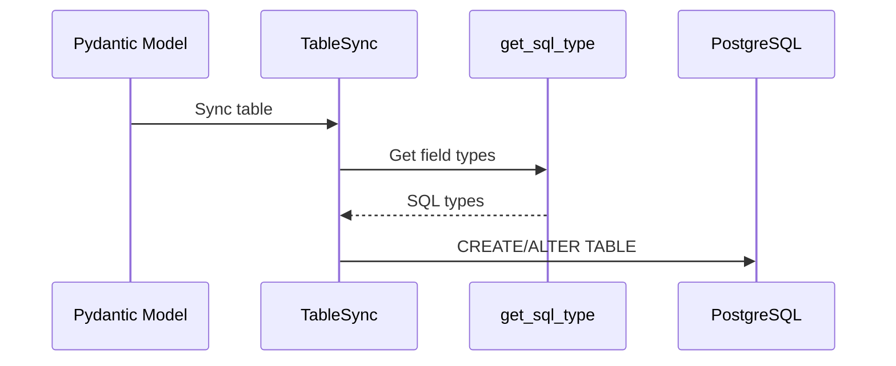
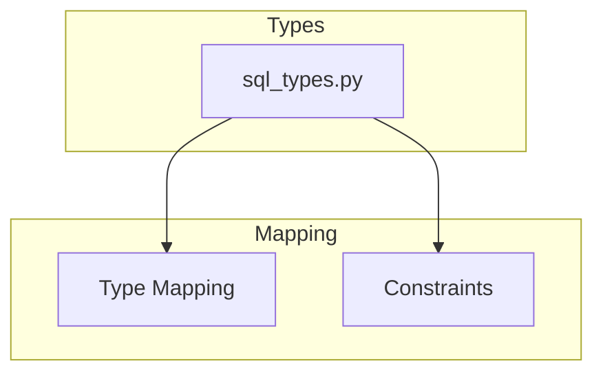
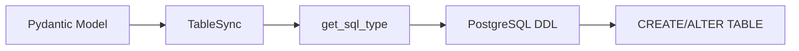

# Types

This module provides custom type definitions and typing utilities for **wpostgresql**, including Pydantic to PostgreSQL type mapping.

---

## 1. 🚶 Diagram Walkthrough



## 2. 🗺️ System Workflow



## 3. 🏗️ Architecture Components



## 4. ⚙️ Container Lifecycle

### Build Process
- Type mapping functions available at import
- No compilation needed

### Runtime Process
1. TableSync invoked
2. For each model field, get_sql_type called
3. SQL DDL generated
4. PostgreSQL executes

## 5. 📂 File-by-File Guide

| File | Purpose |
|------|---------|
| `sql_types.py` | Pydantic to PostgreSQL mapping |

---

## Components

### sql_types.py

Provides type mapping between Python/Pydantic and PostgreSQL:

```python
def get_sql_type(field) -> str
```

#### Type Mapping

| Pydantic Type | PostgreSQL Type |
|---------------|-----------------|
| `int` | `INTEGER` |
| `str` | `TEXT` |
| `bool` | `BOOLEAN` |

#### Constraint Support

Constraints can be defined via field description:

| Description | SQL Constraint |
|-------------|----------------|
| `primary` | `PRIMARY KEY` |
| `unique` | `UNIQUE` |
| `not null` | `NOT NULL` |

## Usage

This module is used internally during table synchronization. You typically don't need to import it directly:

```python
from wpostgresql.types import get_sql_type

# Map Pydantic field to SQL type
sql_type = get_sql_type(field)
# Returns: "INTEGER PRIMARY KEY"
```

## Integration

The types module is used by `TableSync` to generate SQL DDL statements:



## Example

```python
from pydantic import Field
from wpostgresql.types import get_sql_type

# Field with constraint
field = Field(description="primary not null")

# Get SQL type
sql_type = get_sql_type(field)
# Result: "INTEGER PRIMARY KEY"
```

## Author

**William Rodríguez** - [wisrovi](mailto:wisrovi.rodriguez@gmail.com)

Technology Evangelist & Software Architect

LinkedIn: [William Rodríguez](https://www.linkedin.com/in/william-rodriguez-villamizar-572302207)
